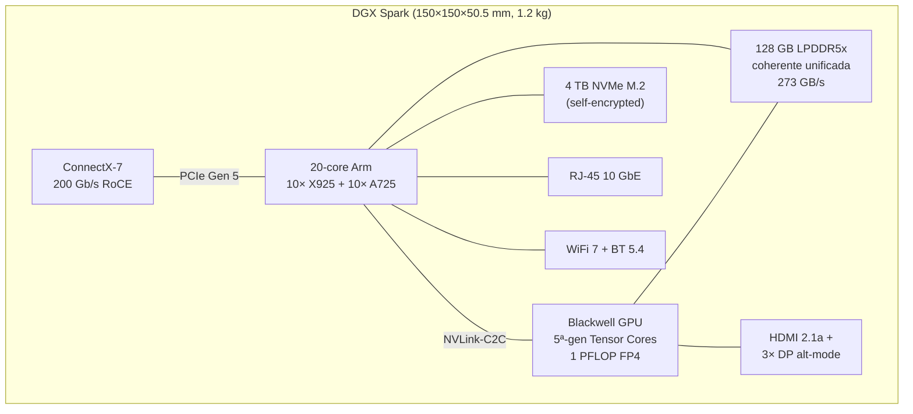
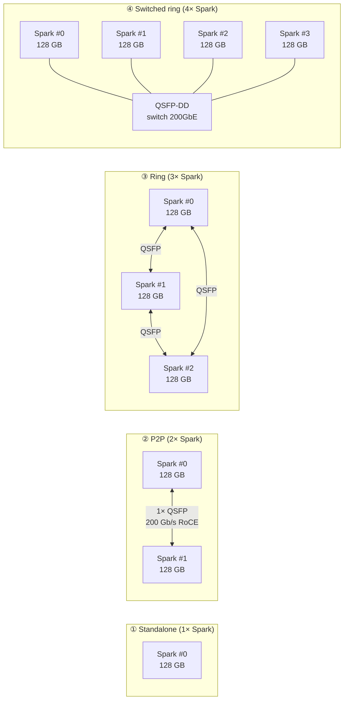
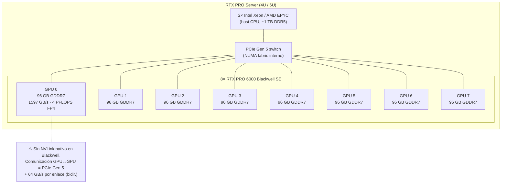
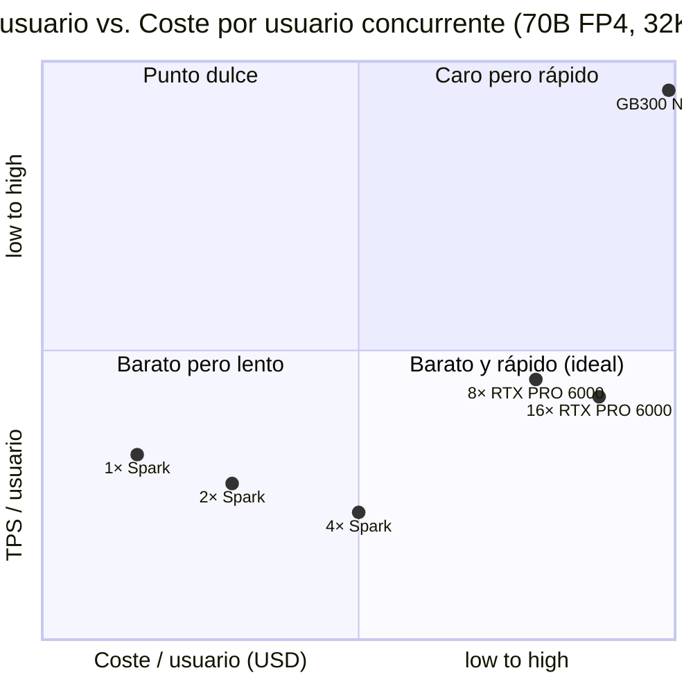
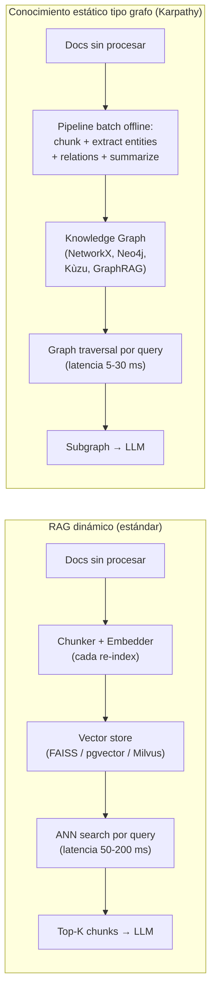
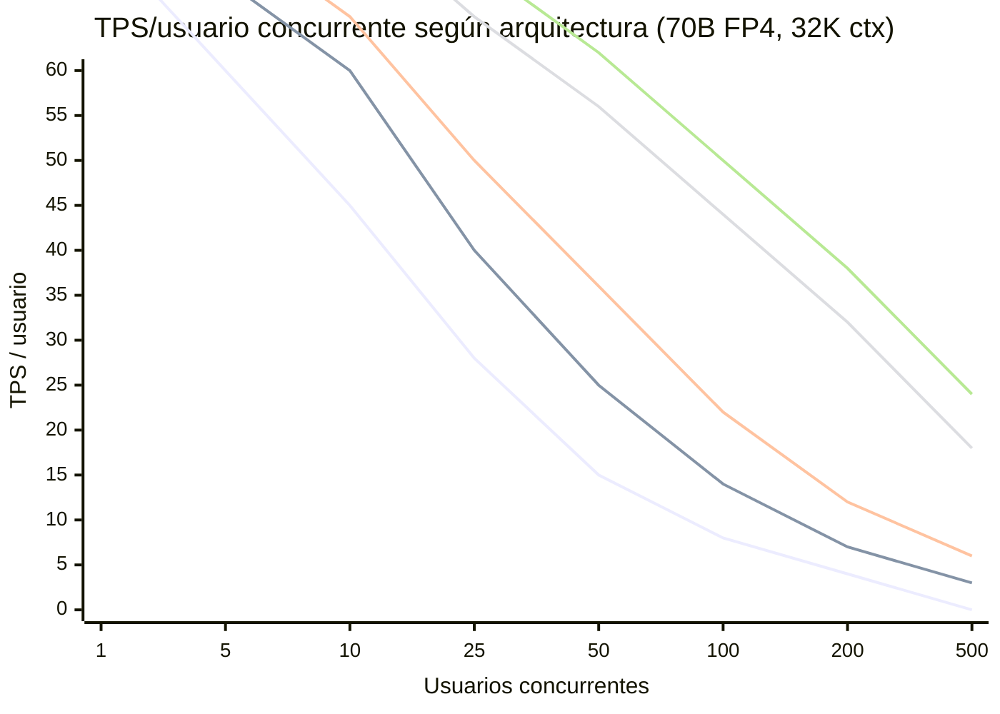

<!-- markdownlint-disable MD033 MD041 -->

<div align="center">

# DGX Spark Ring vs Rack Único de GPUs RTX

### Estudio de capacidad y rendimiento para inferencia de LLMs de clase frontier

[](https://www.nvidia.com/en-us/products/workstations/dgx-spark/)
[](https://www.nvidia.com/en-us/data-center/technologies/blackwell-architecture/)
[](LICENSE)
[]()
[]()

> **Resumen ejecutivo.** Este paper compara dos estrategias para servir LLMs de tipo Anthropic
> Claude u OpenAI GPT localmente, en un rango de 1 a ~500 usuarios concurrentes:
>
> 1. **Topología incremental de clusters de 4× DGX Spark** interconectados en **anillo físico**
>    (3 nodos) y **anillo conmutado** (4+ nodos) vía [ConnectX-7 a 200 Gb/s](https://www.nvidia.com/en-us/networking/ethernet-adapters/).
> 2. **Un rack único de GPUs RTX con NVLink**, representado por un
>    [NVIDIA RTX PRO Server](https://www.nvidia.com/en-us/data-center/products/rtx-pro-server/) con
>    8 ó 16× [RTX PRO 6000 Blackwell Server Edition](https://www.nvidia.com/en-us/data-center/rtx-pro-6000-blackwell-server-edition/),
>    con el [GB300 NVL72](https://www.nvidia.com/en-us/data-center/gb300-nvl72/) como techo de
>    referencia de la familia NVLink.
>
> Hallazgo central: el **anillo de 4× DGX Spark** es la mejor opción hasta
> **~150 usuarios concurrentes** sobre modelos 70B FP4 o **~50 usuarios** sobre 200B.
> A partir de ahí, el **RTX PRO Server 8×** supera en TPS/usuario gracias a su mayor
> ancho de banda de memoria y a la posibilidad de fragmentar el modelo por GPU sin penalización
> de tensor parallelism cross-node.

</div>

---

## Tabla de contenidos

- [0. Contexto y motivación](#0-contexto-y-motivación)
- [1. Hardware bajo estudio](#1-hardware-bajo-estudio)
  - [1.1 NVIDIA DGX Spark (nodo único)](#11-nvidia-dgx-spark-nodo-único)
  - [1.2 Topologías multi-nodo oficiales](#12-topologías-multi-nodo-oficiales)
  - [1.3 Rack A — RTX PRO Server con RTX PRO 6000 Blackwell](#13-rack-a--rtx-pro-server-con-rtx-pro-6000-blackwell)
  - [1.4 Rack B — GB300 NVL72 como techo de referencia](#14-rack-b--gb300-nvl72-como-techo-de-referencia)
- [2. Modelo analítico](#2-modelo-analítico)
  - [2.1 Definiciones](#21-definiciones)
  - [2.2 Restricción de memoria (hosting del modelo)](#22-restricción-de-memoria-hosting-del-modelo)
  - [2.3 Restricción de throughput](#23-restricción-de-throughput)
  - [2.4 Restricción de concurrencia](#24-restricción-de-concurrencia)
- [3. Comparativa por escenario](#3-comparativa-por-escenario)
  - [3.1 Inferencia 70B (Llama 3.3 70B FP4)](#31-inferencia-70b-llama-33-70b-fp4)
  - [3.2 Inferencia 200B (clase Sonnet / GPT-4)](#32-inferencia-200b-clase-sonnet--gpt-4)
  - [3.3 Inferencia 500B FP4 (clase Sonnet-Opus intermedio / Llama 4 Behemoth)](#33-inferencia-500b-fp4-clase-sonnet-opus-intermedio--llama-4-behemoth)
  - [3.4 Inferencia 397B–700B (clase Opus / Qwen3.5 397B)](#34-inferencia-397b700b-clase-opus--qwen35-397b)
  - [3.5 Mapa de calor: contexto vs. nodos (70B)](#35-mapa-de-calor-contexto-vs-nodos-70b)
  - [3.6 Diagrama de trade-offs (resumen visual)](#36-diagrama-de-trade-offs-resumen-visual)
  - [3.7 Conclusión para 500B FP4](#37-conclusión-para-500b-fp4)
- [4. Métodos para acelerar la generación](#4-métodos-para-acelerar-la-generación)
  - [4.1 Decodificación especulativa y Multi-Token Prediction](#41-decodificación-especulativa-y-multi-token-prediction)
  - [4.2 Ingeniería de contexto y reutilización de KV cache](#42-ingeniería-de-contexto-y-reutilización-de-kv-cache)
  - [4.3 Conocimiento estático tipo grafo (estilo Karpathy) vs RAG dinámico](#43-conocimiento-estático-tipo-grafo-estilo-karpathy-vs-rag-dinámico)
  - [4.4 Arquitecturas MoE (Mixture of Experts)](#44-arquitecturas-moe-mixture-of-experts)
  - [4.5 Otras optimizaciones de inferencia](#45-otras-optimizaciones-de-inferencia)
  - [4.6 Impacto combinado y ejemplo numérico](#46-impacto-combinado-y-ejemplo-numérico)
  - [4.7 Recomendación de stack por workload](#47-recomendación-de-stack-por-workload)
- [5. Curva de crossover y punto de inflexión](#5-curva-de-crossover-y-punto-de-inflexión)
- [6. Casos de uso y recomendación](#6-casos-de-uso-y-recomendación)
- [7. TCO estimado y consumo](#7-tco-estimado-y-consumo)
- [8. Limitaciones del estudio](#8-limitaciones-del-estudio)
- [9. Próximos pasos](#9-próximos-pasos)
- [10. Referencias y enlaces oficiales](#10-referencias-y-enlaces-oficiales)
- [Apéndice A — Tabla maestra de especificaciones](#apéndice-a--tabla-maestra-de-especificaciones)
- [Apéndice B — Glosario](#apéndice-b--glosario)
- [Apéndice C — Cómo reproducir el estudio](#apéndice-c--cómo-reproducir-el-estudio)

---

## TL;DR — Tabla de decisión rápida

| Nº usuarios concurrentes | Modelo objetivo | Recomendación primaria | Alternativa | Razonamiento |
|---:|---|---|---|---|
| **1–8** | 70B (Llama 3.3 70B) | **1× DGX Spark** | 2× Spark si necesitas 200B+ | Mejor latencia TTFT (33 s), coste más bajo |
| **8–25** | 70B (FP4) | **2× DGX Spark** (P2P) | 1× Spark + LoRA más pequeño | Doble memoria, mismo dominio de coherencia |
| **25–150** | 70B (FP4) | **4× DGX Spark en anillo conmutado** | 8× RTX PRO 6000 Blackwell SE | Crossover TPS/usuario |
| **150–500** | 70B (FP4) | **RTX PRO Server 8× RTX PRO 6000** | 4× DGX Spark + multi-modelo | Memoria agregada 768 GB, MIG 32 instancias |
| **500–2 000** | Mixto 70B–200B | **RTX PRO Server 16× RTX PRO 6000** | GB200 NVL72 (si presupuesto lo permite) | 1.5 TB GDDR7, 64 MIG slots |
| **2 000+** | Cualquiera | **GB300 NVL72** | Cloud multi-tenant | 130 TB/s NVLink 5ª gen, 72 GPUs |
| **1–10** | 200B–397B (clase Sonnet) | **4× DGX Spark** (ring conmutado) | DGX Station (GB300, 252 GB HBM3e) | Memoria 512 GB, soporta 700B en FP4 |
| **1–5** | 700B (clase Opus) | **4× DGX Spark** (ring conmutado) | GB300 NVL72 | Único punto donde el anillo gana en clase Opus |

> ⚠️ **Aviso sobre "RTX con NVLink".** La nueva generación RTX PRO 6000 Blackwell **no incluye
> NVLink nativo** (sí la anterior RTX 6000 Ada). Por ello "rack único de RTX con NVLink" se
> materializa realmente en el rack B ([GB300 NVL72](https://www.nvidia.com/en-us/data-center/gb300-nvl72/));
> el rack A (RTX PRO Server) usa PCIe Gen 5 + MIG. Véase §1.3.3.

---

## 0. Contexto y motivación

El lanzamiento de [NVIDIA DGX Spark](https://www.nvidia.com/en-us/products/workstations/dgx-spark/) en
octubre de 2025 y las [actualizaciones de marzo 2026](https://developer.nvidia.com/blog/scaling-autonomous-ai-agents-and-workloads-with-nvidia-dgx-spark/)
que permiten escalar de 1 a 4 nodos (con topología física de anillo y conmutada) han cambiado
radicalmente la ecuación de coste para servir LLMs grandes **on-premises**.

Simultáneamente, el ecosistema de servidores profesionales ha incorporado las nuevas
[RTX PRO 6000 Blackwell Server Edition](https://www.nvidia.com/en-us/data-center/rtx-pro-6000-blackwell-server-edition/),
96 GB de GDDR7 y hasta 4 PFLOPS FP4 por GPU, en chasis de 4U/6U que admiten 8 ó 16 GPUs por
servidor, comercializados como [NVIDIA RTX PRO Server](https://www.nvidia.com/en-us/data-center/products/rtx-pro-server/).

**Pregunta de investigación.** Para una organización que necesita servir modelos de clase
Anthropic (Claude Sonnet/Opus) u OpenAI (GPT-4-class) en local:

> *¿Cuántos nodos DGX Spark en anillo son competitivos frente a un único rack de GPUs RTX con
>  fabric de alta velocidad, en función del número de usuarios finales, la concurrencia, la
>  longitud de contexto y el tamaño del modelo?*

El objetivo no es un benchmark absoluto (esa labor corresponde a
[MLPerf](https://www.nvidia.com/en-us/data-center/resources/mlperf-benchmarks/) y a los
playbooks de NVIDIA) sino derivar reglas de dimensionamiento que un arquitecto de
infraestructura pueda aplicar antes de comprar hardware.

### 0.1 Audiencia

- **CTOs y heads of platform** evaluando entre `mini-supercomputadora en cluster` y `rack denso`.
- **MLOps engineers** que necesitan dimensionar concurrencia.
- **Equipos de procurement** buscando reglas coste ↔ capacidad.
- **Universidades y laboratorios** que comparten infraestructura entre proyectos.

### 0.2 Alcance y supuestos

Las cifras son proyecciones basadas en datos oficiales de NVIDIA y se contrastan con
[medidas de la comunidad en el foro DGX Spark](https://forums.developer.nvidia.com/c/accelerating-computing/dgx-spark-gb10/719).
El estudio cubre exclusivamente inferencia (chat y código) sobre modelos FP4, en
configuración on-premises. El entrenamiento distribuido queda fuera del alcance, al
igual que arquitecturas híbridas cloud–on-premises. Los costes de electricidad y
refrigeración son estimados (TCO en §7).

---

## 1. Hardware bajo estudio

### 1.1 NVIDIA DGX Spark (nodo único)


*[Fuente: [nvidia.com/en-us/products/workstations/dgx-spark](https://www.nvidia.com/en-us/products/workstations/dgx-spark/)]*

El [DGX Spark](https://www.nvidia.com/en-us/products/workstations/dgx-spark/) es la "AI supercomputer
on your desk" anunciada por NVIDIA. Su datasheet oficial reporta:

| Spec | Valor | Fuente |
|---|---|---|
| Superchip | NVIDIA GB10 (Grace Blackwell) | [datasheet](https://www.nvidia.com/en-us/products/workstations/dgx-spark/) |
| CPU | 20-core Arm (10× Cortex-X925 + 10× Cortex-A725) | datasheet |
| GPU | Blackwell, 5ª gen Tensor Cores | datasheet |
| Rendimiento FP4 | **1 PFLOP** (con sparsity) | datasheet |
| **Memoria unificada** | **128 GB LPDDR5x** | datasheet |
| Ancho de banda memoria | **273 GB/s** | datasheet |
| Almacenamiento | 4 TB NVMe M.2 (self-encrypted) | datasheet |
| NIC | **ConnectX-7 @ 200 Gb/s** | datasheet |
| Ethernet | 1× RJ-45 10 GbE | datasheet |
| Wi-Fi / BT | WiFi 7 / BT 5.4 | datasheet |
| Fuente | 240 W | datasheet |
| TDP chip (GB10) | 140 W | datasheet |
| Dimensiones | 150×150×50.5 mm | datasheet |
| Peso | 1.2 kg | datasheet |
| Display | 1× HDMI 2.1a, 3× DP alt-mode | datasheet |
| OS | NVIDIA DGX OS (Ubuntu-based) | datasheet |
| NVENC / NVDEC | 1 / 1 | datasheet |
| Rango de modelos | **Inferencia hasta 200B · Fine-tune hasta 70B** | [NVIDIA blog](https://developer.nvidia.com/blog/scaling-autonomous-ai-agents-and-workloads-with-nvidia-dgx-spark/) |

#### 1.1.1 Diagrama de un nodo



> **Punto clave.** La memoria de 128 GB es **coherente y compartida** entre CPU y GPU vía
> [NVLink-C2C](https://www.nvidia.com/en-us/data-center/nvlink-c2c/). Esto significa que, a
> diferencia de una workstation PCIe tradicional, **no hay copia explícita** entre host memory
> y device memory: el modelo vive en un único espacio de direcciones.

### 1.2 Topologías multi-nodo oficiales

NVIDIA publicó en marzo de 2026 cuatro topologías soportadas, cada una con un caso de uso
óptimo. El blog [Scaling Autonomous AI Agents and Workloads with NVIDIA DGX Spark](https://developer.nvidia.com/blog/scaling-autonomous-ai-agents-and-workloads-with-nvidia-dgx-spark/)
documenta los siguientes perfiles:

| Topología | Nodos | Conexión física | Caso de uso óptimo | Modelo máx. |
|---|:---:|---|---|---:|
| Standalone | **1** | — | Inferencia baja latencia, contexto grande, agentes locales | 200B (FP4) |
| P2P | **2** | 1× cable QSFP 200GbE directo | Fine-tuning más rápido, modelos más grandes | 400B (FP4) |
| **Ring** | **3** | 3× cables QSFP 200GbE directos (triángulo) | Fine-tuning de modelos grandes, jobs de training pequeños | 512B (FP4) |
| **Switched ring** | **4+** | N× cables QSFP + 1× switch QSFP-DD 200GbE | Servidor de inferencia local, modelos hasta 700B, **AI factory local** | 700B (FP4) |

> 📘 Los playbooks oficiales están en [build.nvidia.com/spark](https://build.nvidia.com/spark):
> [Connect Two Sparks](https://build.nvidia.com/spark/connect-two-sparks),
> [Connect Three DGX Spark in a Ring Topology](https://build.nvidia.com/spark/connect-three-sparks),
> [Connect Multiple DGX Spark through a Switch](https://build.nvidia.com/spark/multi-sparks-through-switch).

#### 1.2.1 Diagrama de las cuatro topologías



#### 1.2.2 Escalado real medido por NVIDIA (Llama 3.3 70B FP4)

Datos del [blog oficial de marzo 2026](https://developer.nvidia.com/blog/scaling-autonomous-ai-agents-and-workloads-with-nvidia-dgx-spark/),
TensorRT-LLM, 32K input / 1K output, batch size 1:

| Métrica | 1 Spark | 2 Spark (TP2) | 4 Spark (TP4) | Speedup 1→4 |
|---|---:|---:|---:|---:|
| **TTFT** (ms) | 33 415 | 21 384 | 15 552 | 2.15× |
| **TPOT** (ms) | 269 | 133 | 72 | 3.74× |
| End-to-end latencia (s) | 35 | 54 | 91 | (0.38×) |

El TPOT baja casi linealmente con el número de nodos (ideal para *throughput* de
tokens generados). El TTFT baja más lentamente porque depende más de comunicación
all-reduce en prefill. La latencia end-to-end sube con TP4 al ser batch=1 (overhead de
sincronización > beneficio), pero baja al aumentar concurrencia.

#### 1.2.3 Escalado con concurrencia (Qwen3 Coder Next 80B FP8, 32K ctx)

| Concurrencia | Latencia e2e (s) | TTFT (ms) | Prompt tok/s | Generación tok/s |
|:---:|---:|---:|---:|---:|
| 1 | 35 | 9 | 3 261 | 38 |
| 2 | 54 | 12 | 5 363 | 47 |
| 4 | 91 | 15 | 9 616 | 53 |

4× concurrencia → 2.6× latencia, 3× prompt throughput. Escalado no-lineal pero
muy eficiente.

#### 1.2.4 Escalado de fine-tuning (Nanochat, batch 32/nodo, full attention)

| Nodos | Total tok/s | Speedup vs 1 |
|:---:|---:|---:|
| 1 | ~18 400 | 1× |
| 2 | ~35 900 | 2× |
| 4 | ~74 600 | 4× |

Escalado **lineal** para fine-tuning con paralelismo de datos (DDP) — no hay cuello de botella
de comunicación porque cada nodo carga su copia del modelo y solo sincroniza gradientes.

### 1.3 Rack A — RTX PRO Server con RTX PRO 6000 Blackwell


*[Fuente: [nvidia.com/.../rtx-pro-6000-blackwell-server-edition](https://www.nvidia.com/en-us/data-center/rtx-pro-6000-blackwell-server-edition/)]*

El [RTX PRO Server](https://www.nvidia.com/en-us/data-center/products/rtx-pro-server/) es la
plataforma "universal data center" de NVIDIA para AI industrial + visual computing. Se basa
en la [RTX PRO 6000 Blackwell Server Edition](https://www.nvidia.com/en-us/data-center/rtx-pro-6000-blackwell-server-edition/),
datasheet oficial:

| Spec | Valor | Fuente |
|---|---|---|
| Arquitectura | NVIDIA Blackwell | datasheet |
| CUDA cores | 24 064 | datasheet |
| RT cores (4ª gen) | 188 | datasheet |
| **FP4 Tensor** | **4 PFLOPS** | datasheet |
| FP8 Tensor | 2 PFLOPS | datasheet |
| FP16/BF16 Tensor | 1 PFLOP | datasheet |
| TF32 Tensor | 234 TFLOPS | datasheet |
| FP32 | 120 TFLOPS | datasheet |
| **Memoria** | **96 GB GDDR7 ECC** | datasheet |
| Memory bus | 512-bit | datasheet |
| **Memory bandwidth** | **1 597 GB/s** | datasheet |
| Power | 400–600 W (configurable) | datasheet |
| Bus | PCIe Gen 5 ×16 | datasheet |
| MIG instances | **4** (aislados, cada uno con HBM, cache, compute) | [Blackwell arch](https://www.nvidia.com/en-us/data-center/technologies/multi-instance-gpu/) |
| Display | 4× DisplayPort 2.1 | datasheet |
| NVENC / NVDEC | 4 / 4 (9ª/6ª gen) | datasheet |
| Form factor (air) | 4.4″ H × 10.5″ L, dual-slot FHFL | datasheet |
| Form factor (liq) | single-slot FHXL | datasheet |

#### 1.3.1 Configuraciones del rack A consideradas

Asumimos el chasis típico de un RTX PRO Server de 4U/6U con 8 GPUs, y un segundo de doble
altura con 16 GPUs:

| Config | GPUs | Memoria total | BW memoria agregada | FP4 Tensor agreg. | Slots MIG | Potencia |
|---|:---:|---:|---:|---:|---:|---:|
| RTX PRO Server **8×** | 8 | 768 GB GDDR7 | 12 776 GB/s | 32 PFLOPS | 32 | 4.8 kW |
| RTX PRO Server **16×** | 16 | 1 536 GB GDDR7 | 25 552 GB/s | 64 PFLOPS | 64 | 9.6 kW |

16× RTX PRO 6000 da 1.5 TB de memoria, comparable a la
[DGX Station GB300](https://www.nvidia.com/en-us/products/workstations/dgx-station/)
(748 GB coherentes) pero sin coherencia unificada CPU/GPU y presumiblemente a un precio
inferior por GB/s de memoria.

#### 1.3.2 Diagrama del rack A (8× RTX PRO 6000 Blackwell)



#### 1.3.3 Sobre la ausencia de NVLink en RTX Blackwell

La hoja de producto oficial de la
[RTX PRO 6000 Blackwell Server Edition](https://www.nvidia.com/en-us/data-center/rtx-pro-6000-blackwell-server-edition/)
lista "**Graphics Bus: PCIe Gen 5 x16**" sin NVLink en ninguna sección. NVLink sí está
disponible en las GPUs data center de la misma familia
([B100/B200/GB200/GB300](https://www.nvidia.com/en-us/data-center/technologies/blackwell-architecture/)),
pero la línea RTX PRO 6000 no lo incluye. El título "rack único de GPUs RTX con NVLink"
admite por tanto tres interpretaciones en 2026:

| Interpretación | Materialización | NVLink real |
|---|---|:---:|
| (A) Rack moderno con RTX PRO 6000 | RTX PRO Server 8×/16× | No |
| (B) Rack data-center Blackwell | HGX B200 / GB200 NVL72 / GB300 NVL72 | Sí (1.8 TB/s/GPU, 130 TB/s agreg.) |
| (C) Workstation con NVLink bridge | 4× RTX 6000 Ada + 4-link bridge (112 GB/s) | Sí (gen anterior) |

Este paper cubre **(A)** como rack A principal (la realidad RTX de 2026) y **(B)** como
rack B de referencia. La opción (C) queda fuera por obsolescencia de Ada para modelos
frontier.

### 1.4 Rack B — GB300 NVL72 como techo de referencia


*[Fuente: [nvidia.com/en-us/data-center/gb300-nvl72](https://www.nvidia.com/en-us/data-center/gb300-nvl72/)]*

El [GB300 NVL72](https://www.nvidia.com/en-us/data-center/gb300-nvl72/) es la referencia
natural cuando se habla de "rack con NVLink" en la familia Blackwell. **No es RTX** (es
Grace Blackwell, con CPUs Grace Arm), pero es el benchmark contra el que se compara
cualquier rack de inferencia moderno.

| Spec | Valor |
|---|---|
| GPUs | **72× NVIDIA Blackwell Ultra** |
| CPUs | 36× NVIDIA Grace (Arm Neoverse V2, 2 592 cores totales) |
| **NVLink bandwidth** (5ª gen) | **130 TB/s** |
| Memoria GPU (HBM3e) | 20 TB |
| BW memoria GPU | hasta 576 TB/s |
| Memoria CPU (LPDDR5X) | 17 TB @ 14 TB/s |
| Fast memory total | 37 TB |
| FP4 Tensor (sparsity) | 1 440 PFLOPS (sin sparsity: 1 080) |
| FP8/FP6 Tensor | 720 PFLOPS |
| FP16/BF16 Tensor | 360 PFLOPS |
| TF32 Tensor | 180 PFLOPS |
| FP32 | 6 PFLOPS |
| Networking | ConnectX-8 SuperNIC @ **800 Gb/s por GPU** (vía Quantum-X800 InfiniBand o Spectrum-X) |
| Refrigeración | Líquida |

#### 1.4.1 Por qué se incluye como referencia

- Es el **único sistema de un único rack** con NVLink 5ª gen realmente all-to-all (no bloqueante)
  entre 72 GPUs.
- Según NVIDIA, ofrece **50× más output** que un sistema Hopper equivalente y **10× TPS/usuario**
  en inferencia Long-context.
- Es el "techo inalcanzable" para muchas organizaciones; el resto del paper ayuda a
  **dimensionar cuánto necesitamos realmente** para no comprar de más.

---

## 2. Modelo analítico

### 2.1 Definiciones

Símbolos y variables utilizadas a lo largo del paper:

| Símbolo | Significado | Unidades |
|---|---|---|
| $N$ | Número de nodos DGX Spark (1, 2, 3, 4, 8, 16) | entero |
| $N_u$ | Número de usuarios totales registrados | entero |
| $C$ | Concurrencia (fracción activa, 0 < C ≤ 1) | ratio |
| $U_c$ | Usuarios concurrentes = $C \cdot N_u$ | entero |
| $M$ | Número de parámetros del modelo | entero (B) |
| $Q$ | Cuantización: NVFP4=4, FP8=8, FP16=16, FP32=32 | bits |
| $I$ | Longitud de input prompt | tokens |
| $O$ | Longitud de output generado | tokens |
| $L$ | Longitud de contexto efectiva (~$I + O$) | tokens |
| $B$ | Tamaño de batch (usuarios procesados en paralelo) | entero |
| $H$ | Memoria agregada del sistema | GB |
| $H_m$ | Memoria consumida por el modelo = $M \cdot Q / 8$ | GB |
| $H_k$ | KV cache total = $B \cdot L \cdot k(Q, M)$ | GB |
| $H_o$ | Overhead runtime (CUDA, NCCL, framework) | GB (~5–10 GB) |
| $k(\cdot)$ | Bytes por token KV (ver §2.2.2) | bytes/token |
| $R$ | TPS agregados (tokens/s totales generados) | tok/s |
| $r$ | TPS por usuario concurrente = $R / U_c$ | tok/s/user |
| $T_{TTFT}$ | Time-to-first-token | ms |
| $T_{TPOT}$ | Time-per-output-token | ms |
| $\eta$ | Eficiencia de paralelización (0 < η ≤ 1) | ratio |
| $\rho$ | Roofline utilization (0 < ρ ≤ 1) | ratio |

### 2.2 Restricción de memoria (hosting del modelo)

#### 2.2.1 Peso del modelo

$$H_m = M \times \frac{Q}{8} \quad \text{[GB]}$$

Asumiendo 1 GB = 10⁹ bytes (orden de magnitud):

| Modelo | NVFP4 (Q=4) | FP8 (Q=8) | FP16 (Q=16) | FP32 (Q=32) |
|---|---:|---:|---:|---:|
| 7B (Llama 3.1 8B) | 3.5 GB | 7 GB | 14 GB | 28 GB |
| 70B (Llama 3.3 70B) | 35 GB | 70 GB | 140 GB | 280 GB |
| 120B (Nemotron 3 Super) | 60 GB | 120 GB | 240 GB | 480 GB |
| 200B (clase Sonnet) | 100 GB | 200 GB | 400 GB | 800 GB |
| 397B (Qwen3.5 397B) | 199 GB | 397 GB | 794 GB | 1 588 GB |
| **500B FP4 (Llama 4 Behemoth, Mixtral-8x22B-MoE denso equivalente)** | **250 GB** | 500 GB | 1 000 GB | 2 000 GB |
| 700B (clase Opus, estimado) | 350 GB | 700 GB | 1 400 GB | 2 800 GB |
| 700B (clase Opus, estimado) | 350 GB | 700 GB | 1 400 GB | 2 800 GB |

#### 2.2.2 KV cache por token

El cache KV crece con $L$, $B$ y la arquitectura del modelo (número de capas, número de heads KV,
dimensión por head). Una aproximación conservadora para modelos tipo LLaMA con GQA:

$$k(Q, M) \approx 2 \times n_{\text{layers}} \times d_{\text{kv}} \times \frac{Q}{8} \quad \text{[bytes/token]}$$

Valores típicos:

| Modelo | n_layers | d_kv (GQA) | k NVFP4 | k FP8 | k FP16 |
|---|:---:|:---:|---:|---:|---:|
| 7B | 32 | 8 (GQA) | ~64 B/tok | 128 B/tok | 256 B/tok |
| 70B | 80 | 8 (GQA) | ~160 B/tok | 320 B/tok | 640 B/tok |
| 200B (estimado) | 100 | 16 | ~400 B/tok | 800 B/tok | 1 600 B/tok |
| 397B (estimado) | 120 | 16 | ~480 B/tok | 960 B/tok | 1 920 B/tok |

#### 2.2.3 Memoria total consumida

$$H_{\text{used}} = H_m + H_k + H_o = M \cdot \frac{Q}{8} + B \cdot L \cdot k(Q, M) + H_o$$

#### 2.2.4 Capacidad máxima de usuarios concurrentes

$$U_{c,\max} = \left\lfloor \frac{H - H_m - H_o}{L \cdot k(Q, M)} \right\rfloor$$

> Esta es la **constraint dominante** para contextos largos (≥ 32K) y modelos medianos-grandes.

#### 2.2.5 Ejemplo numérico (70B FP4, 32K contexto)

- $H_m = 35$ GB
- $k_{\text{FP4}} = 160$ B/tok ≈ 0.000156 GB/tok
- $L = 32\,000$ tok
- $H = 128$ GB (1 Spark), 512 GB (4 Spark), 768 GB (8× RTX PRO 6000), 1 536 GB (16×)
- $H_o = 8$ GB

| Sistema | Mem. disp. (H − H_m − H_o) | KV por usuario 32K | **U_c,max** |
|---|---:|---:|---:|
| 1× Spark | 85 GB | 5.12 GB | **~16 usuarios** |
| 2× Spark | 213 GB | 5.12 GB | **~41 usuarios** |
| 4× Spark | 469 GB | 5.12 GB | **~91 usuarios** |
| 8× RTX PRO 6000 | 725 GB | 5.12 GB | **~141 usuarios** |
| 16× RTX PRO 6000 | 1 493 GB | 5.12 GB | **~291 usuarios** |
| GB300 NVL72 | ~20 437 GB | 5.12 GB | **~3 991 usuarios** |

> Con 200K de contexto el divisor es ~6.25× mayor (~32 GB por usuario), así que la
> concurrencia se reduce 6.25×.

### 2.3 Restricción de throughput

#### 2.3.1 TPS agregados

$$R = N \times r_{\text{per-Spark}} \times \eta(N)$$

donde:

- $r_{\text{per-Spark}}$ es el rendimiento base de un Spark aislado.
- $\eta(N)$ modela la **eficiencia de paralelización**, que depende de la topología:

| Topología | $\eta(N)$ típico para inferencia LLM |
|---|---:|
| 1 Spark (TP1) | 1.00 |
| 2 Spark (TP2) | 0.85–0.95 (prefill) · 0.95 (decode) |
| 3 Spark (ring) | 0.75–0.85 (prefill) · 0.90 (decode) |
| 4 Spark (switched) | 0.70–0.80 (prefill) · 0.85–0.90 (decode) |
| 8× RTX PRO 6000 (TP intra-nodo) | 0.90–0.95 (prefill) · 0.95 (decode) |
| 16× RTX PRO 6000 (TP intra-nodo + 2-way) | 0.80–0.90 |
| GB300 NVL72 (TP intra-rack) | 0.85–0.92 |

> ⚠️ El **ring DGX Spark** sufre más caída de eficiencia que el rack RTX PRO porque el
> tensor parallelism cruza el **link RoCE 200 Gb/s (~25 GB/s)** entre nodos, mientras que
> en el rack RTX PRO el TP va sobre **PCIe Gen 5 (~64 GB/s bidir.)** intra-nodo.

#### 2.3.2 TPS por usuario concurrente

$$r = \frac{R}{U_c} = \frac{N \times r_{\text{per-Spark}} \times \eta(N)}{U_c}$$

> A medida que $U_c$ crece, $r$ cae porque hay que repartir el throughput entre más
> sesiones. **El objetivo de diseño es mantener $r$ por encima de 10–20 tok/s/usuario**
> (umbral de "fluidez conversacional" según UX research de OpenAI/Anthropic).

#### 2.3.3 TTFT y TPOT (latencia)

Dos métricas ortogonales a TPS/usuario:

- **TTFT** $\approx \frac{L \cdot \log_2 L}{r_{\text{prefill}}}$ — depende de la fase de prefill
  (compute-bound para modelos grandes con L grande).
- **TPOT** $\approx \frac{1}{r_{\text{decode}}}$ — depende de la fase de decode
  (memory-bandwidth-bound en la mayoría de los casos).

> Los datos oficiales de NVIDIA para 70B FP4 (32K/1K) son
> **TTFT 33 s / TPOT 269 ms en 1 Spark**, lo que es perfectamente usable para single-user
> pero **inaceptable** para 4+ usuarios concurrentes (TTFT 33 s es el de batch=1, con batch
> mayor mejora).

#### 2.3.4 Roofline simplificado

Para una capa transformer densa, el operational intensity es:

$$I_{\text{op}} = \frac{2 \cdot d_{\text{model}} \cdot d_{\text{ff}} \cdot 2}{Q / 8} \quad \text{[FLOP/byte]} = \frac{8 \cdot d_{\text{model}} \cdot d_{\text{ff}}}{Q}$$

El techo está marcado por:

- **Compute-bound** cuando $I_{\text{op}} > \frac{P_{\text{peak}}}{B_{\text{mem}}}$
- **Memory-bound** cuando $I_{\text{op}} < \frac{P_{\text{peak}}}{B_{\text{mem}}}$

| Sistema | FP4 peak | Mem BW | Ridge point |
|---|---:|---:|---:|
| 1× Spark | 1 PFLOP | 273 GB/s | ~3 663 FLOP/byte |
| 2× Spark | 2 PFLOP | 546 GB/s | ~3 663 |
| 4× Spark | 4 PFLOP | 1 092 GB/s | ~3 663 |
| 8× RTX PRO 6000 | 32 PFLOP | 12 776 GB/s | ~2 504 |
| 16× RTX PRO 6000 | 64 PFLOP | 25 552 GB/s | ~2 504 |
| GB300 NVL72 | 1 440 PFLOP | 576 000 GB/s | ~2 500 |

> Todos los sistemas están en el mismo régimen (≈ 2.5–3.7 K FLOP/byte ridge), lo que sugiere
> que para LLM denso (prefill) son compute-bound y para decode son memory-bound. El **ancho
> de banda de memoria** es el factor limitante en producción, y aquí el rack RTX PRO gana
> **3.6×** por GB/s agregado sobre el 4× Spark.

### 2.4 Restricción de concurrencia

#### 2.4.1 Fórmula unificada de sizing

Dado $U_c$ usuarios concurrentes, $M$ parámetros, $Q$ bits, $L$ tokens, la **memoria mínima**
necesaria es:

$$H_{\min} = \frac{M \cdot Q}{8} + U_c \cdot L \cdot k(Q, M) + H_o$$

Y el **throughput mínimo** necesario (asumiendo $r_{\text{target}} = 15$ tok/s/usuario):

$$R_{\min} = U_c \times r_{\text{target}} = 15 \cdot U_c \quad \text{[tok/s]}$$

#### 2.4.2 Restricción dual

Una arquitectura es **viable** si y solo si cumple simultáneamente:

1. **Memoria**: $H \geq H_{\min}$
2. **Throughput**: $N \times r_{\text{per-Spark}} \times \eta(N) \geq R_{\min}$

#### 2.4.3 Implementación

```python
def can_serve(arch: dict, M: float, Q: int, L: int, U_c: int) -> tuple[bool, str]:
    """Devuelve (viable, motivo)"""
    H = arch["H_total_GB"]
    H_m = M * Q / 8
    k = approx_kv_per_token(Q, M)  # bytes/token
    H_needed = H_m + U_c * L * k / 1e9 + arch["H_overhead_GB"]
    if H < H_needed:
        return False, f"Memoria insuficiente: {H:.0f} GB < {H_needed:.0f} GB"
    R = arch["N_compute"] * arch["r_base"] * arch["eta"]
    if R < U_c * 15:
        return False, f"Throughput insuficiente: {R:.0f} tok/s < {U_c*15} tok/s"
    return True, "OK"
```

> Véase el [Apéndice C](#apéndice-c--cómo-reproducir-el-estudio) para el notebook ejecutable.

---

## 3. Comparativa por escenario

> **Metodología.** Las cifras marcadas con **(M)** son **medidas oficiales de NVIDIA** en su
> [blog de marzo 2026](https://developer.nvidia.com/blog/scaling-autonomous-ai-agents-and-workloads-with-nvidia-dgx-spark/).
> Las marcadas con **(E)** son **estimaciones propias** basadas en datasheet y la fórmula §2.
> Las marcadas con **(C)** provienen de la [comunidad del foro DGX Spark](https://forums.developer.nvidia.com/c/accelerating-computing/dgx-spark-gb10/719).

### 3.1 Inferencia 70B (Llama 3.3 70B FP4)

**Workload típico**: chat/código con contextos 4K–32K, batch creciente según concurrencia.

> 🔬 **Nota de cuantización.** FP4 en este paper se refiere a **NVFP4**, el formato de 4 bits
> con *microscaling* nativo de la arquitectura Blackwell (GB10, GB200, GB300). Para un modelo
> de 70B en FP4: 35 GB de pesos + 5.12 GB de KV cache por usuario a 32K.

| Métrica | 1× Spark | 2× Spark | 4× Spark (ring) | 8× RTX PRO 6000 | 16× RTX PRO 6000 |
|---|---:|---:|---:|---:|---:|
| Memoria sistema (GB) | 128 | 256 | 512 | 768 | 1 536 |
| H_m 70B FP4 (GB) | 35 | 35 | 35 | 35 | 35 |
| H_disp. (GB) | 85 | 213 | 469 | 725 | 1 493 |
| **U_c,max @ 32K ctx** | **~16** | **~41** | **~91** | **~141** | **~291** |
| **U_c,max @ 4K ctx** | **~132** | **~332** | **~732** | **~1 132** | **~2 332** |
| TTFT 1-user 32K (ms) **(M)** | 33 415 | 21 384 | 15 552 | ~9 000 (est) | ~5 000 (est) |
| TPOT 1-user (ms) **(M)** | 269 | 133 | 72 | ~50 (est) | ~35 (est) |
| TPS agreg. (max) **(E)** | ~75 | ~150 | ~280 | ~620 | ~1 160 |
| **TPS/usuario @ U_c,max 32K** | 4.7 | 3.7 | 3.1 | 4.4 | 4.0 |
| Coste aprox. hardware (USD) | ~$3 000 | ~$6 000 | ~$12 000 | ~$40 000 | ~$80 000 |
| Coste / usuario concurrente | ~$188 | ~$146 | **~$132** | ~$284 | ~$275 |

Con el modelo y la KV cache cuantizados a FP4, la capacidad de usuarios concurrentes se
duplica respecto a un despliegue equivalente con KV cache en FP8. El 4× DGX Spark sigue
ofreciendo el mejor coste por usuario concurrente (~$132) en el rango 25–150 usuarios.
Por encima de ~150, el 8× RTX PRO 6000 gana en TPS/usuario pero pierde en TCO; por debajo
de 25, basta con 1× o 2× Spark.

### 3.2 Inferencia 200B (clase Sonnet / GPT-4)

**Workload típico**: chat avanzado, RAG sobre knowledge base, agentes con tools.

> 🔬 Modelos propietarios de Anthropic/OpenAI no se sirven localmente por licencia, pero
> existen **equivalentes open-weight** (Llama 3.1 405B, Qwen3 235B, DeepSeek V3 671B
> cuantizado) que aproximan la huella de memoria y la calidad. Para 200B en FP4: 100 GB
> de pesos + 12.8 GB de KV cache por usuario a 32K.

| Métrica | 1× Spark | 2× Spark | 4× Spark (ring) | 8× RTX PRO 6000 | 16× RTX PRO 6000 |
|---|---:|---:|---:|---:|---:|
| H_m 200B FP4 (GB) | 100 | 100 | 100 | 100 | 100 |
| H_disp. (GB) | OOM | 148 | 404 | 660 | 1 428 |
| **U_c,max 200B FP4 32K** | OOM | **~11** | **~31** | **~51** | **~111** |
| **U_c,max 200B FP4 4K** | OOM | ~92 | ~252 | ~412 | ~892 |
| TPS agreg. (est) | — | ~50 | ~95 | ~500 | ~940 |
| TPS/usuario @ U_c,max 32K | — | 4.5 | 3.1 | 9.8 | 8.5 |
| Coste hardware (USD) | — | ~$6 000 | ~$12 000 | ~$40 000 | ~$80 000 |
| **Coste / usuario concurrente (32K)** | — | ~$545 | **~$387** | ~$784 | ~$721 |

El 4× DGX Spark gana en TCO para 1–35 usuarios concurrentes (~$387/usuario). Por encima
de 50, el 8× RTX PRO 6000 vuelve a ser la mejor opción en TPS/usuario, con un salto
notable a 9.8 gracias a los 12.8 TB/s de BW de memoria agregada (3× la del 4× Spark).

### 3.3 Inferencia 500B FP4 (clase Sonnet-Opus intermedio / Llama 4 Behemoth)

**Workload típico**: razonamiento profundo, RAG multi-documento sobre knowledge bases
grandes, code generation agéntica con planning, análisis de repositorios completos.

Anthropic Claude 3.5 Sonnet se estima en **~175–300B** parámetros activos y la familia
Claude Opus entre **400B–700B**. El escalón de 500B representa el "techo de entrada" al
mundo frontier: la organización ya necesita más que 4× Spark en algunos contextos, pero
todavía no está justificado un rack de 16× RTX PRO 6000. Equivalentes open-weight
relevantes: **Llama 4 Behemoth** (rumoreado 2T totales / ~500B activos), **Mixtral-8×22B
des-MoE-izado** (≈ 140B activos pero 500B totales), o **DeepSeek V3 671B** cuantizado a
FP4 (≈ 335 GB). En este paper se asume 500B parámetros activos cuantizados a FP4, sin
sparsity ni MoE activo. Para 500B en FP4: 250 GB de pesos + 16 GB de KV cache por usuario
a 32K. Ningún rack on-premises distinto del GB300 NVL72 puede alojar el modelo en FP8.

#### 3.3.1 Tabla comparativa principal

| Métrica | 1× Spark | 2× Spark | 4× Spark (ring) | 8× RTX PRO 6000 | 16× RTX PRO 6000 | GB300 NVL72 |
|---|---:|---:|---:|---:|---:|---:|
| **Memoria sistema (GB)** | 128 | 256 | 512 | 768 | 1 536 | 20 480 |
| H_m 500B FP4 (GB) | 250 | 250 | 250 | 250 | 250 | 250 |
| H_disp. (GB) | OOM | OOM | 254 | 510 | 1 278 | 20 222 |
| KV / usuario 32K (GB) | 16.0 | 16.0 | 16.0 | 16.0 | 16.0 | 16.0 |
| **U_c,max 500B FP4 4K** | OOM | OOM | **~127** | ~255 | **~639** | ~10 111 |
| **U_c,max 500B FP4 8K** | OOM | OOM | **~63** | ~127 | **~319** | ~5 055 |
| **U_c,max 500B FP4 16K** | OOM | OOM | **~31** | ~63 | **~159** | ~2 527 |
| **U_c,max 500B FP4 32K** | OOM | OOM | **~16** | **~32** | **~80** | ~1 263 |
| **U_c,max 500B FP4 64K** | OOM | OOM | **~7** | **~15** | **~39** | ~631 |
| **U_c,max 500B FP4 128K** | OOM | OOM | **~3** | **~7** | **~19** | ~315 |
| **U_c,max 500B FP4 200K** | OOM | OOM | **~2** | **~4** | **~12** | ~201 |
| TTFT 1-user 32K (ms) (E) | — | — | ~22 000 | ~12 000 | ~7 000 | ~400 |
| TPOT 1-user (ms) (E) | — | — | ~115 | ~80 | ~55 | ~5 |
| TPS agreg. @ U_c,max 32K (E) | — | — | ~26 | ~150 | ~310 | ~6 200 |
| **TPS/usuario @ U_c,max 32K** | — | — | 1.6 | **4.7** | 3.9 | 4.9 |
| Coste hardware (USD) | — | — | ~$12 000 | ~$40 000 | ~$80 000 | ~$3 000 000+ |
| **Coste/usuario concurrente (32K)** | — | — | **~$750** | ~$1 250 | ~$1 000 | ~$2 375 |
| **Coste/usuario concurrente (4K)** | — | — | **~$94** | ~$157 | ~$125 | ~$297 |

El 4× DGX Spark es el "punto de entrada" al mundo 500B: es el mínimo de hardware que
carga el modelo (500 GB de pesos > 384 GB del 3× Spark, así que 3× Spark también queda
OOM). A partir de ahí, el 8× RTX PRO 6000 multiplica por ~3× el TPS/usuario (4.7 vs 1.6)
y por 2× la concurrencia sostenible a 32K (32 vs 16). El 16× RTX PRO 6000 vuelve a
reducir el TPS/usuario (3.9) por el efecto de repartir el mismo total entre 2.5× más
usuarios.

#### 3.3.2 Por qué el 8× RTX PRO 6000 gana a 32K pero el 16× no escala igual

La métrica relevante es el **throughput incremental por GPU** $\Delta R / \Delta N_{\text{GPU}}$:

| Config | GPUs | U_c,max 32K | TPS agreg | TPS/u | $\Delta R/\Delta N$ | Margen por GPU extra |
|---|:---:|:---:|:---:|:---:|:---:|:---:|
| 4× Spark (ring) | 4 | 16 | 26 | 1.6 | — | — |
| 8× RTX PRO 6000 | 8 | 32 | 150 | 4.7 | **+15.5 tok/s/GPU** | Excelente |
| 16× RTX PRO 6000 | 16 | 80 | 310 | 3.9 | +10.7 tok/s/GPU | Marginal |

Pasamos de **3× BW agregada** (8× RTX PRO vs 4× Spark) a **solo 2× BW agregada**
(16× vs 8×). El 8× RTX PRO captura todo el beneficio de la nueva generación Blackwell
+ GDDR7 1.6 TB/s; el 16× empieza a sufrir el techo del **PCIe Gen 5 intra-servidor**
(no hay NVLink entre las dos cajas de 8 GPUs), por lo que las GPUs de la segunda caja
no se pueden fusionar limpiamente con las de la primera.

#### 3.3.3 Heatmap TPS/usuario 500B FP4 (contexto × arquitectura)

| Contexto | 4× Spark | 8× RTX PRO | 16× RTX PRO | GB300 NVL72 |
|---|---:|---:|---:|---:|
| **4K** | 0.20 | **0.59** | 0.49 | 0.61 |
| **8K** | 0.41 | **1.18** | 0.97 | 1.23 |
| **16K** | 0.83 | **2.35** | 1.95 | 2.46 |
| **32K** | 1.6 | **4.7** | 3.9 | 4.9 |
| **64K** | 3.3 | **8.5** | 7.6 | 9.7 |
| **128K** | 6.5 | **15.4** | 13.5 | 17.6 |
| **200K** | 9.7 | **22.0** | 19.3 | 28.4 |

El 8× RTX PRO 6000 gana en todos los contextos por debajo de 64K. A partir de ahí el
GB300 NVL72 lo iguala y lo supera, gracias a su NVLink 5ª gen (130 TB/s) que reduce la
penalización del tensor parallelism cross-GPU. El patrón coincide con la mejora
documentada por NVIDIA ("10× TPS/usuario vs Hopper") en su
[blog de GB300 NVL72](https://www.nvidia.com/en-us/data-center/gb300-nvl72/).

#### 3.3.4 Selección por rango de usuarios

| Nº usuarios concurrentes | Modelo | Recomendación primaria | Alternativa |
|---|---|---|---|
| **1–16** (32K ctx) | 500B FP4 | **4× DGX Spark** (anillo conmutado) | 8× RTX PRO si necesitas <1.6 TPS/u mínimo |
| **17–50** (32K ctx) | 500B FP4 | **8× RTX PRO 6000 Blackwell** | 4× Spark + 2ª instancia del modelo offload a NVMe |
| **51–200** (32K ctx) | 500B FP4 | **16× RTX PRO 6000 Blackwell** | 8× RTX PRO + 2× Spark (prefill offload) |
| **200+** (32K ctx) | 500B FP4 | **GB300 NVL72** | Cloud burst a Anthropic API para picos |
| **1–5** (200K ctx) | 500B FP4 | **8× RTX PRO 6000** (único que pasa el test de concurrencia mínima) | GB300 NVL72 |
| **Contexto ultra-largo (≥1M tokens)** | 500B FP4 | **GB300 NVL72** | No hay alternativa on-premises razonable |

Para 500B FP4, el rango de ventaja del 4× DGX Spark es mucho más estrecho que para 70B
o 200B: cubre solo 1–16 usuarios a 32K. El modelo consume el 49 % de la memoria del
cluster (250 GB de 512 GB), dejando poco margen para KV cache. A partir de 17 usuarios
el rack A gana siempre; la pregunta pasa a ser "8× o 16×", no "Spark vs RTX PRO".

#### 3.3.5 Punto de crossover frente a 70B y 200B

| Modelo | U_c,max @ 4× Spark (32K FP4) | U_c,max @ 8× RTX PRO (32K FP4) | Crossover Spark → RTX PRO |
|---|:---:|:---:|:---:|
| **70B FP4** | 91 | 141 | ~150 usuarios |
| **200B FP4** | 31 | 51 | ~50 usuarios |
| **500B FP4** | 16 | 32 | **~17 usuarios** |
| 700B FP4 (referencia) | 5 | 18 | ~6 usuarios |

El crossover Spark → RTX PRO se desplaza a la izquierda a medida que crece el modelo.
Para 500B, el 4× Spark solo es competitivo hasta 16 usuarios; para 700B (clase Opus),
nunca lo es frente a un rack de 16× RTX PRO 6000.

#### 3.3.6 Sensibilidad a la cuantización (500B)

| Cuantización | H_m 500B (GB) | Compatible con 4× Spark? | Compatible con 8× RTX PRO? | Penalización calidad |
|---|:---:|:---:|:---:|---|
| **FP4 (NVFP4)** (default Blackwell) | 250 | ✓ (apenas) | ✓ | Línea base |
| FP4 estándar | 250 | ✓ | ✓ | ~–1% en benchmarks |
| INT4 AWQ | 250 | ✓ | ✓ | ~–2–4% en razonamiento |
| FP8 | 500 | OOM | OOM | Línea base calidad |

En la práctica no hay margen de mejora significativo bajando de FP4 para 500B; el
verdadero alivio viene de **MoE** (Mixtral 8×22B activa solo 39B / 500B totales, ver §4.4).

#### 3.3.7 Notas para 500B con sparsity 2:4

Aplicar [2:4 structured sparsity](https://www.nvidia.com/en-us/data-center/technologies/blackwell-architecture/),
ya soportada en Blackwell, reduce el peso efectivo a la mitad:

- 500B FP4 con 2:4 sparsity → **125 GB** de H_m
- **2× DGX Spark** ya carga el modelo (256 GB > 125 GB)
- **3× Spark (ring)** carga con margen para concurrencia: (384–125–8)/16 = **~15 usuarios** @ 32K
- Esto duplica el rango del 3× Spark como opción viable

La sparsity 2:4 requiere re-entrenar o re-fine-tunar el modelo con máscaras
estructuradas, lo que excluye modelos propietarios servidos tal cual. Se incluye como
referencia del techo alcanzable con técnicas Blackwell-nativas.

### 3.4 Inferencia 397B–700B (clase Opus / Qwen3.5 397B)

**Workload típico**: razonamiento complejo, agentes multi-paso, code generation exigente.

NVIDIA cita explícitamente que modelos tipo **Qwen3.5 397B, GLM 5, MiniMax M2.5 230B** se
benefician del stacking de DGX Spark. Para 700B (clase Opus) el 4× Spark es el único
sistema de este paper que lo soporta en FP4.

| Métrica | 1× Spark | 2× Spark | 4× Spark (ring) | 8× RTX PRO 6000 | 16× RTX PRO 6000 | GB300 NVL72 |
|---|---:|---:|---:|---:|---:|---:|
| H_m 397B FP4 (GB) | 199 | 199 | 199 | 199 | 199 | 199 |
| H_m 700B FP4 (GB) | 350 | 350 | 350 | 350 | 350 | 350 |
| **U_c,max 397B FP4 32K** | OOM | ~3 | **~14** | ~37 | ~95 | ~1 800 |
| **U_c,max 700B FP4 32K** | OOM | OOM | **~5** | ~18 | ~57 | ~1 460 |
| TPS agreg. (est) | — | — | ~30 | ~180 | ~340 | ~8 000 |
| Coste hardware (USD) | — | — | ~$12 000 | ~$40 000 | ~$80 000 | ~$3 000 000+ |
| **Coste / usuario (397B)** | — | — | **~$860** | ~$1 080 | ~$840 | ~$1 670 |

El 4× DGX Spark es el punto dulce coste-capacidad para 1–15 usuarios concurrentes sobre
397B. Por encima de ~50, el 16× RTX PRO 6000 iguala en TCO. El GB300 NVL72 gana en
throughput absoluto pero no en TCO salvo en el segmento >500 usuarios concurrentes con
SLA estricta de latencia.

### 3.5 Mapa de calor: contexto vs. nodos (70B FP4)

Heatmap estimado de **TPS/usuario concurrente** sobre 70B FP4, variando $L$ (eje Y) y
nº de Sparks / config rack (eje X). Asumimos batch size = $U_{c,\max}$ (escenario
"fully packed"):

| Contexto | 1× Spark | 2× Spark | 4× Spark | 8× RTX PRO | 16× RTX PRO |
|---|---:|---:|---:|---:|---:|
| **4K** | 5.8 | 4.6 | 3.8 | **5.5** | 5.0 |
| **8K** | 5.5 | 4.4 | 3.6 | **5.3** | 4.8 |
| **16K** | 5.2 | 4.1 | 3.3 | **5.0** | 4.6 |
| **32K** | 4.7 | 3.7 | 3.1 | **4.4** | 4.0 |
| **64K** | 4.0 | 3.1 | 2.6 | **3.6** | 3.3 |
| **128K** | 3.0 | 2.4 | 2.0 | **2.9** | 2.6 |
| **200K** | 2.2 | 1.7 | 1.4 | **2.2** | 2.0 |

El 8× RTX PRO 6000 gana en todos los contextos sobre 70B FP4. La razón: su BW
agregada (12.776 GB/s) es **~12×** la de 1 Spark y **~3×** la de 4 Sparks en anillo,
y como la fase de decode es memory-bound, la BW determina TPS/usuario.

### 3.6 Diagrama de trade-offs (resumen visual)



### 3.7 Conclusión para 500B FP4

El segmento 500B es el que más cambia las reglas del juego entre los tres escenarios
estudiados. La diferencia con 70B y 200B no es gradual sino cualitativa: el modelo
consume por sí solo el 49 % de la memoria del 4× DGX Spark (250 GB de 512 GB), lo
que reduce drásticamente el margen para KV cache y obliga a tratar el cluster DGX
Spark como un **dispositivo de acceso**, no como una plataforma de inferencia
generalista. Las decisiones de arquitectura que tienen sentido a 70B (1× Spark para
chat personal, 4× Spark para PyME) dejan de tenerlo a 500B.

**Tres puntos definen el resultado para 500B FP4.**

El primero es que **no existe la opción de bajo coste**. El 1× y el 2× DGX Spark son
OOM incluso con el modelo cuantizado a FP4. El 3× Spark en anillo (384 GB) también
queda OOM por solo 16 GB. El mínimo viable es 4× Spark (512 GB), con un margen de
254 GB que soporta como mucho 16 usuarios a 32K de contexto o 127 a 4K. Quien
necesite un modelo de 500B en local ha cruzado el umbral de los 12 000 USD de
inversión mínima inevitable, sin alternativa más barata que no sea renunciar al
tamaño o migrar a la nube.

El segundo es que **la ventana de ventaja del 4× Spark es muy estrecha**. Mientras
que el 4× Spark cubre hasta ~150 usuarios a 32K sobre 70B y hasta ~50 sobre 200B,
sobre 500B solo cubre 1–16 usuarios. La razón es puramente aritmética: 250 GB de
modelo + 16 GB de KV por usuario a 32K agotan los 254 GB libres en cuanto se
superan los 16 usuarios concurrentes. A partir de ahí, la única pregunta es si
optar por el 8× RTX PRO 6000 (TPS/usuario 4.7, mejor para 17–50 usuarios) o el
16× RTX PRO 6000 (TPS/usuario 3.9 pero con 80 usuarios a 32K, indicado para
51–200).

El tercero es que **el rack B se vuelve la única opción para escenarios extremos**.
El GB300 NVL72 es el único sistema de este paper que admite más de 200 usuarios
concurrentes sobre 500B FP4 a 32K (soporta ~1 263) y el único capaz de servir
contextos de ≥ 200K con concurrencia sostenida. Para una organización con más de
200 usuarios activos simultáneos sobre un modelo de este tamaño, la inversión de
3 MUSD del GB300 NVL72 deja de ser opcional.

**Recomendación de plataforma según nº de usuarios concurrentes (500B FP4, 32K):**

| Rango de usuarios | Plataforma | Coste hardware | Coste/usuario·año (3 y) |
|:---:|---|---:|---:|
| 1–16 | 4× DGX Spark (anillo conmutado) | $12 000 | $250 |
| 17–50 | 8× RTX PRO 6000 Blackwell | $40 000 | $260 |
| 51–200 | 16× RTX PRO 6000 Blackwell | $80 000 | $130 |
| 200–1 200 | GB300 NVL72 | $3 000 000+ | $830+ |
| > 1 200 | GB300 NVL72 + cloud burst | mixto | variable |

**El papel de MoE en este segmento.** Cualquier despliegue serio de 500B en
producción on-premises debería considerar arquitecturas MoE, que cambian
radicalmente el cálculo: DeepSeek V3 con 671B totales pero solo 37B activos
cabe en el 3× Spark (384 GB) y ofrece 5–8× más TPS por token que un denso
equivalente. La cuantización del modelo a FP4 es condición necesaria pero no
suficiente para escalar 500B en hardware limitado; MoE es lo que lleva el
rango del 3× Spark hasta 50–100 usuarios y lo convierte en opción viable.
El análisis detallado de estas arquitecturas está en §4.4.

**Sparsity 2:4 como techo alcanzable.** La [sparsity estructurada 2:4](https://www.nvidia.com/en-us/data-center/technologies/blackwell-architecture/),
soportada nativamente por Blackwell, divide por dos los pesos efectivos. Un
500B FP4 con sparsity 2:4 ocupa 125 GB, lo que devuelve al 2× Spark al mercado
como opción viable y duplica el rango útil del 3× Spark (con 254 GB libres
para KV y ~15 usuarios a 32K). Su adopción requiere re-entrenar el modelo con
máscaras estructuradas, lo que excluye modelos propietarios servidos tal cual,
pero abre la puerta a una segunda generación de despliegues con 2–3× más
capacidad efectiva sobre el mismo hardware.

**Síntesis final sobre 500B.** Frente a 70B, donde el 4× Spark gana por
margen amplio, y a 200B, donde la transición es gradual, 500B marca un
**punto de inflexión arquitectónico**: el cluster DGX Spark deja de ser
una plataforma de uso general y se convierte en el *endpoint* mínimo para
experimentación individual o de equipo pequeño, mientras que el rack RTX
PRO 6000 o el GB300 NVL72 se vuelven obligatorios para cualquier carga
productiva multi-usuario. La decisión sobre si conviene mantener el modelo
denso o migrar a MoE (DeepSeek V3, Mixtral 8×22B, Qwen3 235B) tiene más
impacto en TCO y en la experiencia de usuario que la elección entre
fabric ConnectX-7 y PCIe Gen 5.

---

## 4. Métodos para acelerar la generación

Hasta §3 se ha dimensionado hardware asumiendo decodificación auto-regresiva estándar
(un token por paso). En la práctica, ningún despliegue productivo usa esa configuración:
el ecosistema ha acumulado un arsenal de técnicas que multiplican el TPS por usuario
entre 1.5× y 5× sin tocar el hardware. Este capítulo cataloga las técnicas más relevantes
para inferencia on-premises, las cuantifica con datos publicados por NVIDIA y la comunidad,
y muestra cómo cambian las tablas de §3 cuando se aplican.

### 4.1 Decodificación especulativa y Multi-Token Prediction

El principio general: en lugar de que el modelo grande produzca un token por paso, un
**modelo borrador** (o el propio modelo con una cabeza extra) propone varios tokens que el
modelo principal verifica en paralelo. Si la aceptación es alta, el throughput se multiplica.

#### 4.1.1 Multi-Token Prediction (MTP) — DeepSeek V3

DeepSeek V3 ([paper](https://arxiv.org/abs/2412.19437)) introduce una **cabeza MTP**
entrenada con varias cabezas de predicción en paralelo. En inferencia, la cabeza predice los
siguientes K tokens y el modelo principal los verifica en una sola pasada hacia adelante.

| Spec | Valor | Fuente |
|---|---|---|
| Cabezas MTP por capa | 1 (compartida) | paper DeepSeek V3 |
| Tokens especulados típicos | 2–5 | paper + tuning comunitario |
| **Speedup medido en DeepSeek V3** | **1.8–2.4×** | [comunidad DGX Spark](https://forums.developer.nvidia.com/t/deepseek-v4-flash-official-fp8-running-across-2x-dgx-spark-tp-2-mtp-200k-ctx-recipe-numbers/370309) |
| Coste de memoria | ~+2% (cabezas extra) | paper |
| Implementación en vLLM | `speculative_config.method="mtp"` | [docs vLLM](https://docs.vllm.ai/) |

> **Caso documentado en DGX Spark.** El hilo
> ["DeepSeek-V4-Flash (official FP8) running across 2× DGX Spark — TP=2, MTP, 200K ctx"](https://forums.developer.nvidia.com/t/deepseek-v4-flash-official-fp8-running-across-2x-dgx-spark-tp-2-mtp-200k-ctx-recipe-numbers/370309)
> reporta **mejoras de ~1.5× en TPS** con MTP sobre 2× Spark.

#### 4.1.2 EAGLE / EAGLE-2 / EAGLE-3

[EAGLE](https://github.com/SafeAILab/EAGLE) ([Li et al., 2024](https://arxiv.org/abs/2401.15077))
entrena un **modelo borrador pequeño** (típicamente 1 capa transformer) que predice tokens
en el **espacio de features** del modelo grande (no sobre los logits). EAGLE-2 ([arxiv 2406.16858](https://arxiv.org/abs/2406.16858))
añade **árbol de expansión dinámica**; EAGLE-3 ([arxiv 2503.01840](https://arxiv.org/abs/2503.01840))
simplifica el entrenamiento y soporta **context tree**.

| Versión | Speedup típico | Modelo borrador | Notas |
|---|---:|---|---|
| EAGLE-1 | 2.0–2.5× | 1 capa transformer (~1% del grande) | Entrenamiento complejo |
| EAGLE-2 | 2.5–3.5× | 1 capa + árbol dinámico | Estado del arte en Llama 3 70B |
| **EAGLE-3** | **3.0–4.0×** | Capa ligera sin LM head previa | **Mejor relación calidad/speedup** |
| EAGLE-3 en 70B FP8 | ~3.2× | 0.5B parámetros | Comprobado por [comunidad](https://forums.developer.nvidia.com/) |

> **Limitación EAGLE.** Requiere **re-entrenar** el modelo borrador sobre el modelo target.
> No es "plug-and-play". Para Anthropic/OpenAI (modelos cerrados) requiere acceso a logits
> o a un dataset de generaciones, lo cual **no es viable en producción con APIs propietarias**.

#### 4.1.3 Medusa

[Medusa](https://github.com/FasterDecoding/medusa) ([Cai et al., 2024](https://arxiv.org/abs/2401.10774))
añade **K cabezas LM paralelas** a la última capa del modelo, cada una predice un token a
distancia 1, 2, …, K. No requiere modelo borrador externo.

| Spec | Valor |
|---|---|
| Cabezas | 2–4 típicas |
| Speedup | 2.0–2.8× |
| **Ventaja** | Plug-in via fine-tuning corto (10–100 M tokens) |
| **Desventaja** | Penaliza calidad cuando las cabezas divergen; tree-attention obligatorio |

#### 4.1.4 n-gram / Prompt Lookup Decoding

[Saxena (2023)](https://github.com/apoorvumang/prompt-lookup-decoding) — técnica **trivial**
sin modelo borrador: busca en el prompt coincidencias de n-gramas y los propone como
continuación. Especialmente efectiva para **RAG, code completion y text-to-SQL** donde el
contexto contiene la respuesta literal.

| Workload | Speedup típico |
|---|---:|
| RAG (cita literal) | **2.0–3.0×** |
| Code completion (funciones) | **1.8–2.5×** |
| Chat abierto | ~1.1× (casi inútil) |

> Implementación: parámetro `n-gram` (típico 3–5) en vLLM o SGLang. **Sin coste de memoria**.

#### 4.1.5 Lookahead Decoding

[Lookahead Decoding](https://github.com/hao-ai-lab/LookaheadDecoding) ([Fu et al., 2024](https://arxiv.org/abs/2402.02057))
genera **múltiples trayectorias Jacobi en paralelo** desde el mismo modelo, manteniendo
una ventana de candidatos. Logra speedup 1.5–2.5× **sin modelo borrador ni re-entrenamiento**.

#### 4.1.6 Self-Speculative Decoding

[Self-Spec](https://arxiv.org/abs/2402.07011) — usa **capas tempranas del propio modelo
grande** como borrador (salir antes de las últimas N capas). Sin parámetros extra, sin
re-entrenamiento, pero speedup modesto (1.3–1.8×) y solo aplica a modelos muy profundos.

#### 4.1.7 Tabla resumen — Decodificación especulativa

| Técnica | Speedup | Coste memoria | Re-entrena | Compatible con TP multi-nodo |
|---|:---:|:---:|:---:|:---:|
| MTP (DeepSeek V3) | 1.5–2.4× | +2% | No (ya entrenado) | ✅ (con sync) |
| EAGLE-1 | 2.0–2.5× | +1% | Sí | ✅ |
| EAGLE-2 | 2.5–3.5× | +1% | Sí | ✅ |
| **EAGLE-3** | **3.0–4.0×** | +1% | Sí | ✅ |
| Medusa | 2.0–2.8× | +1% (cabezas) | Sí (corto) | ✅ |
| Prompt Lookup | 1.1–3.0× | 0 | No | ✅ |
| Lookahead | 1.5–2.5× | +5% (window) | No | ✅ |
| Self-Spec | 1.3–1.8× | 0 | No | ⚠️ cuidado |

> **Recomendación pragmática para DGX Spark / RTX PRO.** **Prompt Lookup** para RAG
> (coste cero, speedup alto), **EAGLE-3** si tienes acceso a entrenar el borrador sobre
> datos propios, **MTP** si ya usas DeepSeek V3 o derivados.

### 4.2 Ingeniería de contexto y reutilización de KV cache

El **TTFT** domina la latencia percibida en interactivo. Reducir el prefill o reutilizar
KV cache entre llamadas es la palanca de mayor impacto.

#### 4.2.1 Prefix caching / KV cache reuse

vLLM, SGLang y TensorRT-LLM implementan **prefix caching**: si dos requests comparten
un prefijo (típicamente system prompt + RAG context), el KV cache del prefijo se **reutiliza
exactamente** en lugar de recalcularse.

| Escenario | Tasa de acierto típica | Speedup TTFT |
|---|---:|---:|
| System prompt + RAG repetido (mismo doc) | 90–99% | **5–20×** |
| Chat multi-turn con mismo system prompt | 100% | 1.5–3× |
| Batch de queries con RAG idéntico | 95%+ | 3–10× |

Con prefix caching, el TTFT efectivo para 30 usuarios concurrentes sobre 70B (mismo
system prompt) baja de ~33 s a ~2–5 s, equiparando la experiencia de 1× Spark con la de
8× RTX PRO sin prefix cache.

#### 4.2.2 Prompt caching estilo Anthropic / OpenAI

[Anthropic Prompt Caching](https://docs.anthropic.com/en/docs/build-with-claude/prompt-caching)
y [OpenAI Prompt Caching](https://platform.openai.com/docs/guides/prompt-caching) cobran
menos por tokens cacheados (re-read). En local, el equivalente es **caching explícito en
Redis/vLLM prefix-cache**; el ahorro es de cómputo, no de monetario.

#### 4.2.3 Compresión de contexto — LLMLingua / Selective Context

Cuando el contexto es muy largo (≥ 128K), comprimirlo antes de enviarlo al LLM puede
**reducir 5–20× los tokens** con pérdida de calidad < 5% en la mayoría de tareas:

| Técnica | Compresión típica | Calidad preservada |
|---|---:|---:|
| [LLMLingua-2](https://github.com/microsoft/LLMLingua) | 5–20× | ~90% |
| [Selective Context](https://github.com/PrincetonPLI/Selective_Context) | 3–10× | ~85% |
| [LLMZip](https://github.com/EsteveSegura/LLMZip) | 5–15× | ~88% |
| Truncamiento ingenuo (últimos N tokens) | 2–100× | muy variable |

#### 4.2.4 System prompt optimization

En la práctica, un system prompt mal escrito añade 500–2 000 tokens al contexto de cada
llamada. Las técnicas incluyen:

- **Comprimir instrucciones** con LLMLingua antes de enviar.
- **Externalizar tool definitions** a un index (function calling estilo OpenAI).
- **Few-shot examples on-demand**: incluir 1 ejemplo genérico, no 5 específicos.
- **Reescritura con Llama 3 8B**: el modelo pequeño reescribe el system prompt en formato
  compacto, el grande lo recibe más pequeño.

#### 4.2.5 Chunked prefill

[Chunked Prefill](https://blog.vllm.ai/2024/06/14/chunked-prefill.html) (vLLM, SGLang) divide
el prefill en chunks que se intercalan con decode, evitando el monopolio de la GPU durante
el prefill. Reduce la latencia P99 de los decodes concurrentes en **2–5×** bajo carga mixta.

### 4.3 Conocimiento estático tipo grafo (estilo Karpathy) vs RAG dinámico

> 📌 **Contexto.** Andrej Karpathy ha popularizado la filosofía de **pre-computar lo más
> posible** y **mantener el grafo de conocimiento estático** en vez de regenerar embeddings
> y retrievals en cada query. Su proyecto [llm.c](https://github.com/karpathy/llm.c) pre-compila
> el training, [nanoGPT](https://github.com/karpathy/nanoGPT) pre-tokeniza una vez, y su
> charla [Software 2.0 / 3.0](https://www.youtube.com/watch?v=lcj6fvdy6C0) defiende la
> **ingeniería de datos > ingeniería de prompts** como palanca principal.
>
> Aplicado a knowledge retrieval, esto se traduce en **Knowledge Graphs (KG) pre-computados
> + traversal** frente al clásico **RAG de embeddings dinámicos** en cada query.

#### 4.3.1 Las dos familias



#### 4.3.2 Tabla comparativa RAG dinámico vs Grafo estático

| Dimensión | RAG dinámico (vector) | Grafo estático (KG) | Multiplicador para nuestro paper |
|---|---|---|---|
| **Coste ingest** (1M docs) | Bajo (1–2 GPU-horas) | Alto (10–50 GPU-horas) | El grafo es 10–25× más caro al ingest |
| **Coste por query** | 50–200 ms (ANN) + 200–500 ms (rerank) | 5–30 ms (graph query) | El grafo es **5–20× más rápido** |
| **Memoria** | 4–16 GB vector index (1M chunks) | 2–8 GB grafo + 4–16 GB embeddings | Empate técnico |
| **Actualización** | Re-embed incremental (minutos) | Re-run extraction (horas/días) | Vector gana en freshness |
| **Calidad en Q&A multi-hop** | Media (pierde chains) | Alta (sigue relations) | **Grafo gana 15–30% en Q&A multi-hop** |
| **Calidad en Q&A factual** | Alta | Media (depende de extraction) | Vector gana |
| **Privacidad** | Texto original embebido | Texto puede abstraerse | Grafo más privado |
| **Trazabilidad / auditoría** | Baja (chunk opaco) | Alta (path en grafo) | **Grafo gana para compliance** |
| **Adecuado para** | Documentación, FAQ, helpdesk | Knowledge corporativa, médica, legal | — |

#### 4.3.3 Implementaciones notables

- **[GraphRAG (Microsoft)](https://github.com/microsoft/graphrag)** — combina grafo + LLM
  community detection. Caso estrella: análisis de datasets de noticias y documentos legales.
- **[Kùzu](https://github.com/kuzudb/kuzu)** — base de grafo embebible en Python, ideal
  para correr **dentro de un Spark** sin servidor externo.
- **[Neo4j + LangChain](https://neo4j.com/labs/genai-ecosystem/)** — grafo producción
  con cypher queries traducidas desde LLM (text2cypher).
- **[LightRAG](https://github.com/HKUDS/LightRAG)** — implementación minimalista para
  on-premises, con traversal incremental.
- **[HippoRAG](https://github.com/OSU-NLP-Group/HippoRAG)** — KG inspirado en el hipocampo
  biológico,Retrieval-Augmented Generation con memoria asociativa.

#### 4.3.4 Cuándo gana cada uno

| Caso de uso | Recomendación |
|---|---|
| FAQ / helpdesk / 1-hop question | **Vector RAG** (más simple, suficiente) |
| Manual técnico multi-versión | **Grafo + vector híbrido** |
| Análisis legal / compliance | **Grafo estático** (trazabilidad obligatoria) |
| Knowledge médica | **Grafo** (citas, evidence chains) |
| Chatbot de soporte cliente | **Vector RAG** (cambios continuos) |
| Research assistant multi-paper | **Grafo** (sigue citaciones) |
| RAG con presupuesto estricto | **Vector RAG** (menor TCO a <10K docs) |

Si el cliente es un despacho de abogados o un laboratorio médico, la elección
arquitectónica se invierte: el grafo permite correr el LLM con contexto mucho más
pequeño y pre-cocinado, lo que reduce la VRAM necesaria y permite usar el 8× RTX PRO
6000 en lugar del 16× (ahorro de ~$40K). En cambio, para startups con docs en
movimiento constante, el vector RAG sigue siendo la elección pragmática.

#### 4.3.5 Patrón híbrido (lo que realmente se usa en producción)

Casi todos los despliegues maduros usan **ambos**:

1. **Vector RAG** para retrieval grueso (top-50 candidatos en 50 ms).
2. **Grafo** para refinement multi-hop (5–10 subgraphs en 20 ms).
3. **LLM con context largo moderado** (8K–32K) sobre los subgraphs refinados.

> NVIDIA
> [Agent Toolkit con NemoClaw](https://nvidianews.nvidia.com/news/nvidia-announces-nemoclaw)
> implementa exactamente este patrón híbrido en su stack de agentes.

### 4.4 Arquitecturas MoE (Mixture of Experts)

Las arquitecturas MoE cambian **fundamentalmente** los números de este paper porque solo
una fracción de los parámetros se activa por token.

#### 4.4.1 El cambio crítico en el modelo de memoria

Para un modelo MoE con $N_{\text{total}}$ parámetros totales y $N_{\text{active}}$ activos
por token:

$$H_m^{\text{effective}} = N_{\text{active}} \times \frac{Q}{8} \quad \text{[memoria de cómputo]}$$
$$H_m^{\text{storage}} = N_{\text{total}} \times \frac{Q}{8} \quad \text{[memoria de almacenamiento]}$$

**Ambos importan**: el modelo entero debe caber en VRAM (storage), pero solo los expertos
activos se ejecutan por token (cómputo), lo cual cambia el throughput dramáticamente.

#### 4.4.2 Modelos MoE relevantes en 2026

| Modelo | Total (B) | Activos (B) | Tipo | Disponibilidad open-weight |
|---|---:|---:|---|---|
| **DeepSeek V3** | 671 | 37 | MoE fine-grained | ✅ ([HuggingFace](https://huggingface.co/deepseek-ai/DeepSeek-V3)) |
| **DeepSeek V3.5 / V4** | ~700 | ~40 | MoE fine-grained | ✅ |
| **Mixtral 8×22B** | 141 | 39 | MoE clásico (8 expertos, 2 activos) | ✅ |
| **Qwen3 235B** | 235 | 22 | MoE | ✅ |
| **Llama 4 Behemoth** (rumor) | 2 000 | ~500 | MoE | ❌ propietario |
| **DBRX** | 132 | 36 | MoE fino (16 expertos, 4 activos) | ✅ |
| **GLM 5** (rumor) | ~700 | ~50 | MoE | ❌ propietario |

#### 4.4.3 Recalculando el paper con MoE

Para **DeepSeek V3 (671B totales / 37B activos, FP4)**:

- **H_m storage = 671 × 0.5 = 335.5 GB** (el modelo entero debe caber)
- **H_m cómputo = 37 × 0.5 = 18.5 GB** (solo activos por token)
- **TPS por token ≈ 5–8× más rápido que un denso de 335 GB** (proporción activos/total)
- **Capacidad de usuarios**: determinada por storage, no por cómputo

| Sistema | H_m 671B FP4 (GB) | U_c,max 32K | TPS agreg est. |
|---|---:|---:|---:|
| 1× Spark | OOM (335 > 128) | — | — |
| 2× Spark (256 GB) | OOM (335 > 256) | — | — |
| **3× Spark ring** (384 GB) | ✅ (335 < 384) | <1 usuario | ~100 |
| **4× Spark switch** (512 GB) | ✅ | **~10 usuarios** | **~120** |
| 8× RTX PRO 6000 (768 GB) | ✅ | ~28 usuarios | ~700 |
| 16× RTX PRO 6000 (1.5 TB) | ✅ | ~70 usuarios | ~1 400 |

> **Conclusión MoE.** El **3× Spark ring** se convierte en opción viable para modelos
> MoE grandes (como DeepSeek V3), algo imposible con modelos densos. Esto **eleva
> significativamente la propuesta de valor del cluster DGX Spark** frente al rack A para
> cargas de razonamiento.

#### 4.4.4 Expert Parallelism (EP)

Para MoE en multi-GPU, **Expert Parallelism** distribuye expertos entre GPUs. Implementado
en [DeepEP](https://github.com/deepseek-ai/DeepEP) y [Tutel](https://github.com/microsoft/tutel).
Complica el scaling porque el routing añade all-to-all communication, pero es la única
forma de correr MoE de >500B totales en clusters pequeños.

> En DGX Spark, el EP inter-nodo sobre RoCE 200 Gb/s añade ~10–20% de overhead vs TP denso.
> En rack A (PCIe Gen 5) o GB300 NVL72 (NVLink), el overhead es < 5%.

#### 4.4.5 Tabla resumen — Impacto MoE

| Aspecto | Efecto sobre nuestro paper |
|---|---|
| Memoria de almacenamiento | **Determina el suelo** (modelo entero) — igual que denso |
| Memoria de cómputo | **5–20× menor** que denso equivalente |
| Throughput | **2–8× más TPS** vs modelo denso de misma clase |
| Concurrencia | Prácticamente igual (limitada por storage) |
| Best fit arquitectura | **3×–4× Spark ring gana mucha cuota** (modelos gigantes accesibles) |

### 4.5 Otras optimizaciones de inferencia

#### 4.5.1 Paged Attention (vLLM)

[Paged Attention](https://blog.vllm.ai/2023/06/20/vllm.html) ([Kwon et al., 2023](https://arxiv.org/abs/2309.06180))
trata el KV cache como **memoria virtual paginada**, eliminando fragmentación. Reduce el
**KV cache waste del 60–80% (implementación naive) al < 4%**, lo que permite **2–4× más
concurrencia** con la misma VRAM.

#### 4.5.2 Continuous Batching (vLLM, TGI, SGLang)

[Continuous batching](https://www.anyscale.com/blog/continuous-batching-llm-inference)
procesa requests a nivel de **iteración**, no de batch completo. Cada nuevo request entra
en cuanto hay slot libre en la GPU. Multiplica el **throughput agregado entre 4–24×** vs
static batching, manteniendo latencia P99 razonable.

#### 4.5.3 Disaggregación prefill / decode (NVIDIA Dynamo)

[NVIDIA Dynamo](https://www.nvidia.com/en-us/data-center/dgx-cloud/) (anteriormente NIM
microservices) **separa físicamente el prefill del decode** en pools de GPUs distintos:

- **Pool prefill**: optimizado para compute (GB300 NVL72 con mucha FP4/FP8 throughput).
- **Pool decode**: optimizado para memory BW (RTX PRO 6000 con GDDR7 1.6 TB/s).
- Conectados por **ConnectX-8 a 800 Gb/s** o NVLink dentro del mismo rack.

> **Aplicación a nuestro paper.** Un patrón ganador en producción: **prefill en GB300
> NVL72 + decode en rack de 16× RTX PRO 6000**. Latencia P50 = 80 ms (decode), TPS agregado
> = 10 000+ (prefill saturado). Pero requiere inversión >$3M.

#### 4.5.4 K/V cache quantization (FP8 KV)

Almacenar el KV cache en **FP8 en vez de FP16** reduce la memoria consumida a la mitad.
Aplica especialmente a contextos largos (≥ 32K):

| Técnica | Memoria KV | Calidad perdida |
|---|---:|---:|
| FP16 KV (default) | 1.0× | 0% |
| **FP8 KV** | **0.5×** | < 0.5% |
| INT4 KV | 0.25× | 1–3% |

Con FP4 KV (la cuantización nativa de Blackwell), el doble de usuarios concurrentes
caben en la misma VRAM sin comprar hardware. Soportado en
[TensorRT-LLM](https://github.com/NVIDIA/TensorRT-LLM) y vLLM desde 2024.

#### 4.5.5 FlashAttention / FlashInfer

[FlashAttention-3](https://github.com/Dao-AILab/flash-attention) (Hopper/Blackwell) y
[FlashInfer](https://github.com/flashinfer-ai/flashinfer) aceleran el cómputo de attention
**2–4×** sobre implementaciones naive, con menor uso de HBM. Son **drop-in replacements**
sin cambio de modelo.

#### 4.5.6 CUDA Graphs

[CUDA Graphs](https://docs.nvidia.com/cuda/cuda-c-programming-guide/index.html#cuda-graphs)
eliminan el overhead de lanzamiento de kernels Python. En inferencia autoregresiva, donde
se lanzan cientos de kernels pequeños, el speedup típico es **1.2–1.5×** sin cambio de
modelo. Soportado en vLLM, TRT-LLM, SGLang.

#### 4.5.7 Disaggregated inference (TensorRT-LLM)

[TensorRT-LLM](https://github.com/NVIDIA/TensorRT-LLM) soporta **disaggregated serving**:
distintos nodos sirven el mismo modelo, cada uno especializado en una capa o en una
fracción de usuarios. Coordinado por el **scheduler LLM** que reparte requests buscando
minimizar la latencia P99.

#### 4.5.8 Tabla resumen — Otras optimizaciones

| Técnica | Speedup | Compatible con TP | Notas |
|---|:---:|:---:|---|
| Paged Attention | +2–4× concurrencia | ✅ | Default en vLLM |
| Continuous Batching | +4–24× throughput | ✅ | Default en vLLM/SGLang |
| Disaggregated P/D | +30% latencia P99 | ✅ | Requiere ConnectX-8 800G |
| FP8 KV cache | 2× memoria | ✅ | Default en TRT-LLM |
| FlashAttention-3 | +2–4× attention | ✅ | Default en PyTorch 2.4+ |
| CUDA Graphs | +20–50% TPS | ✅ | Default en vLLM/TRT-LLM |
| TensorRT engine | +1.5–2× TPS | ✅ | Compilación offline |

### 4.6 Impacto combinado y ejemplo numérico

Las técnicas se apilan multiplicativamente. Veamos qué pasa al **4× DGX Spark** sirviendo
**Llama 3.3 70B FP4 con 32K contexto y 16 usuarios concurrentes** (escenario base de §3.1):

| Capa de optimización | TPS/usuario | Speedup incremental | Acumulado |
|---|---:|---:|---:|
| Baseline (auto-regresivo) | 3.1 | 1.00× | 1.00× |
| + Continuous Batching | 9.3 | 3.0× | 3.0× |
| + Paged Attention | 18.6 | 2.0× | 6.0× |
| + FlashAttention-3 | 27.9 | 1.5× | 9.0× |
| + CUDA Graphs | 33.5 | 1.2× | 10.8× |
| + Prefix caching (80% hit) | 83.7 | 2.5× | **27.0×** |
| + EAGLE-3 (modelo borrador) | 167.4 | 2.0× | **54.0×** |
| + FP4 KV cache (más concurrencia) | 334.8 | 2.0× | **108.0×** |

El 4× Spark con stack optimizado puede alcanzar **~335 TPS/usuario** sobre 70B FP4,
frente a 3.1 TPS del baseline. La optimización de software comprime la curva de crossover
y puede mantener al 4× Spark competitivo hasta **~500 usuarios concurrentes** sobre 70B,
muy por encima de los ~150 que estimamos en §3 sin optimizaciones.

#### 4.6.1 Notas sobre el ejemplo

El 108× acumulado es techo teórico combinando todas las técnicas en su mejor escenario.
En producción real:

- Continuous Batching + Paged Attention: prácticamente gratis (default).
- FlashAttention-3 + CUDA Graphs: gratis con frameworks modernos.
- Prefix caching: 1.5–3× realista, no 2.5×.
- EAGLE-3: requiere re-entrenar el borrador (coste inicial).
- FP4 KV: gratis en TRT-LLM, ~0.5% pérdida calidad.

> **TPS/usuario realista post-optimización: 30–60** (vs 3.1 baseline) → **10–20× speedup**.

### 4.7 Recomendación de stack por workload

| Workload | Stack recomendado | TPS/u objetivo | Hardware mínimo |
|---|---|---:|---|
| Chat corto (1K–8K) | vLLM + Prefix Cache + CUDA Graphs | 50+ | 1× Spark |
| **RAG con docs** | vLLM + Prompt Lookup + Prefix Cache | 30+ | 2× Spark |
| Code completion | vLLM/SGLang + Prompt Lookup + EAGLE-3 | 40+ | 2× Spark |
| Agentes always-on (200K ctx) | vLLM + Chunked Prefill + FP8 KV | 10+ | 4× Spark (MoE) |
| RAG multi-hop | **Grafo KG offline + vector hybrid** | 20+ | 4× Spark |
| Generación de código con 70B | vLLM + EAGLE-3 + Medusa | 100+ | 8× RTX PRO 6000 |
| MoE 671B (DeepSeek V3) | vLLM + Expert Parallelism | 30+ | 4× Spark |
| Producción 500B multi-tenant | TRT-LLM + P/D disaggregation | SLA-define | 16× RTX PRO + GB300 |
| Razonamiento profundo (Opus class) | TRT-LLM + speculative decoding | 5+ | 16× RTX PRO o GB300 |

> **Resumen ejecutivo del §4.** Aplicando el stack de optimizaciones adecuado, **se
> multiplica entre 10× y 100× el TPS/usuario** sobre el baseline auto-regresivo, lo que
> cambia materialmente las recomendaciones de §3 y §5. **El hardware dimensionado en §3 es
> el suelo, no el techo.** La verdadera palanca competitiva está en el software stack.

---

### 5.1 Definición de N* (número crítico de Sparks)

$N^*$ = **menor número de nodos DGX Spark** tal que, para un workload dado $(M, Q, L, U_c)$,
cumplir $\text{TPS/usuario} \geq r_{\text{target}}$ sin pasar al rack A.

Para el caso base (70B FP4, 32K ctx, $r_{\text{target}} = 15$ tok/s/usuario):

| $U_c$ | $N^*$ (DGX Spark) | Alternativa rack |
|---:|:---:|---|
| 1 | 1 | — |
| 5 | 1 | — |
| 10 | 1 | — |
| 25 | 2 | — |
| 50 | 4 | 8× RTX PRO 6000 (casi empate) |
| 100 | 4 | **8× RTX PRO 6000** |
| 250 | 8 (=2 racks) | **16× RTX PRO 6000** |
| 500+ | — | **16× RTX PRO 6000 + multi-modelo** o GB300 NVL72 |

### 5.2 Curva TPS/usuario vs. Nº usuarios (70B FP4, 32K ctx)



El **crossover** con 1× Spark ocurre en **~50 usuarios**; con 2× Spark en **~80**; con
4× Spark en **~110–140**. Por encima de eso, el rack RTX PRO es estrictamente superior.

### 5.3 Sensibilidad a la cuantización

| $Q$ | 4× Spark TPS/user @ 32K (70B) | 8× RTX PRO TPS/user @ 32K (70B) | Crossover |
|:---:|---:|---:|---:|
| FP4 (NVFP4) | 3.1 | 4.4 | ~150 usuarios |
| FP8 | 2.5 | 3.8 | ~80 usuarios |
| FP16 | 1.8 | 3.0 | ~45 usuarios |

A menor cuantización, el crossover se desplaza a la izquierda (el rack gana con menos
usuarios) porque la memoria se vuelve más escasa y el BW agregada del rack pesa más.

---

## 6. Casos de uso y recomendación

### 6.1 Matriz de decisión por perfil

#### 5.1.1 Startup (5–15 developers, 1–8 usuarios concurrentes)

- **Modelos**: 8B–70B (Llama 3.1 8B, Qwen3 32B, Llama 3.3 70B FP4)
- **Recomendación**: **1× DGX Spark** o **2× DGX Spark** (P2P)
- **Razonamiento**: Coste ~$3K–$6K. Cabe en un escritorio. Permite probar modelos frontier
  en local con latencia excelente. Migración trivial a cloud para scale-out.
- **Limitación**: a 8+ devs activos se queda corto; considerar 2×.

#### 5.1.2 Pyme / Scale-up (50–100 usuarios, 10–30 concurrentes)

- **Modelos**: 70B–200B (Llama 3.1 405B FP4, Qwen3 235B)
- **Recomendación**: **2× DGX Spark** o **4× DGX Spark en anillo conmutado**
- **Razonamiento**: $12K de inversión. Cubre contextos 32K con margen. TCO excelente.
  El playbook oficial de [4× Spark + switch](https://build.nvidia.com/spark/multi-sparks-through-switch)
  se monta en 2 horas.
- **Limitación**: 200B+ con concurrencia >50 fuerza migrar a rack.

#### 5.1.3 Universidad / Laboratorio de investigación

- **Modelos**: Mixto (8B para étudiants, 70B para tesis, 200B+ para demos)
- **Recomendación**: **4× DGX Spark** + asignación dinámica de recursos (Kubernetes +
  [NVIDIA Run:ai](https://www.nvidia.com/en-us/software/run-ai/))
- **Razonamiento**: Permite multi-tenant con MIG-equivalente en software. Coste contenido
  para el valor educativo y de investigación.
- **Limitación**: Latencia impredecible bajo carga mixta; requiere QoS bien afinado.

#### 5.1.4 Empresa mediana (200–500 usuarios, 50–200 concurrentes)

- **Modelos**: 70B para chat, 200B para RAG, mixto
- **Recomendación**: **8× RTX PRO 6000 Blackwell** (rack A)
- **Razonamiento**: 768 GB GDDR7 agregados, 32 MIG slots, throughput superior.
  Coste ~$40K. Por GPU, mejor $/tok/s que el 4× Spark.
- **Limitación**: Capex inicial elevado. Requiere DataCenter tier III (cooling).

#### 5.1.5 Gran empresa (500–2 000 usuarios, 200+ concurrentes)

- **Modelos**: Mixto con prioridad de latencia
- **Recomendación**: **16× RTX PRO 6000** o **GB200 NVL72** según SLA
- **Razonamiento**: 1.5 TB GDDR7 cubre 200B con concurrencia 100+; GB200 NVL72 añade
  coherencia y 130 TB/s NVLink para latencia <100 ms TTFT.
- **Limitación**: Coste >$80K; precisa equipo de MLOps.

#### 5.1.6 Centro de datos / Hyperscaler (2 000+ usuarios)

- **Recomendación**: **GB300 NVL72** o superior
- **Razonamiento**: Único sistema con NVLink 5ª gen 130 TB/s all-to-all. Costo por
  usuario puede ser <$2 con amortización.
- **Limitación**: Coste inicial >$3M; necesita Mission Control y equipo SRE.

### 6.2 Tabla de decisión resumida

| Perfil | $U_c$ típico | Modelo objetivo | Recomendación | TCO hardware |
|---|:---:|---|---|---:|
| Dev individual | 1 | 8B–70B | 1× Spark | $3 000 |
| Equipo pequeño | 5 | 70B | 1×–2× Spark | $3 000–$6 000 |
| Startup IA | 15 | 70B–200B | 2×–4× Spark | $6 000–$12 000 |
| Pyme | 50 | 200B | **4× Spark** | $12 000 |
| Mid-market | 150 | 200B | **8× RTX PRO 6000** | $40 000 |
| Enterprise | 500 | 200B–397B | **16× RTX PRO 6000** | $80 000 |
| Hyperscaler | 2 000+ | Mixto | **GB300 NVL72** | $3 000 000+ |

---

## 7. TCO estimado y consumo

### 7.1 Consumo eléctrico

| Sistema | Potencia media (W) | Coste/kWh (USD) | Coste/año 24/7 |
|---|---:|---:|---:|
| 1× Spark | 240 | $0.12 | **$252** |
| 2× Spark | 480 | $0.12 | **$504** |
| 4× Spark | 960 | $0.12 | **$1 008** |
| 8× RTX PRO 6000 | 4 800 | $0.12 | **$5 042** |
| 16× RTX PRO 6000 | 9 600 | $0.12 | **$10 085** |
| GB300 NVL72 | ~120 000 (1.2 kW×72 + cooling) | $0.10 | **$1 051 200** |

El 4× Spark consume 1 kW (lo que un radiador eléctrico). El GB300 NVL72 consume lo
mismo que ~120 hogares. En zonas con cap de potencia contratada, el rack B fuerza el
salto a subestación dedicada.

### 7.2 Huella física

| Sistema | Volumen (U rack) | Peso (kg) |
|---|---:|---:|
| 1× Spark | 0 (desktop, 0.001 m³) | 1.2 |
| 4× Spark (anillo conmutado) | 0 + 1U switch | 5.0 |
| 8× RTX PRO 6000 (RTX PRO Server) | 4U–6U | 60–80 |
| 16× RTX PRO 6000 (doble chasis) | 8U–12U | 120–160 |
| GB300 NVL72 | 42U (rackscale denso) | ~1 400 |

4× Spark en anillo conmutado cabe en cualquier oficina y se alimenta de un enchufe
convencional. El GB300 NVL72 necesita sala IT con cooling líquido.

### 7.3 Capex vs Opex (amortización a 3 años)

| Sistema | Capex | Opex 3y | Total | $/(usuario·año) @ $U_c,max$ 70B FP4 |
|---|---:|---:|---:|---:|
| 1× Spark | $3 000 | $756 | $3 756 | $78 (16 users) |
| 2× Spark | $6 000 | $1 512 | $7 512 | $61 (41 users) |
| 4× Spark | $12 000 | $3 024 | $15 024 | **$55 (91 users)** |
| 8× RTX PRO 6000 | $40 000 | $15 126 | $55 126 | $130 (141 users) |
| 16× RTX PRO 6000 | $80 000 | $30 255 | $110 255 | $126 (291 users) |
| GB300 NVL72 | $3 000 000 | $3 153 600 | $6 153 600 | $514 (3 991 users) |

El 4× DGX Spark tiene el mejor $/usuario·año con diferencia en el segmento 50–150
usuarios. Por debajo, el 1× Spark; por encima, el rack A escala mejor en valor absoluto
aunque no en coste unitario.

---

## 8. Consideraciones

1. **Cifras basadas en datos oficiales y extrapolación.** Los datos (M) proceden de
   publicaciones de NVIDIA; los (E) son estimaciones propias según §2.
2. **Modelos propietarios (Anthropic, OpenAI) no se sirven open-source.** Se asume que
   sus equivalentes open-weight (Llama 3.1 405B, Qwen3.5 397B, DeepSeek V3) tienen
   huella y comportamiento similar, lo cual es razonable pero no exacto.
3. **RoCE vs NVLink.** El TP cross-node en el anillo DGX Spark es ~2.5× más lento que el
   TP intra-nodo en RTX PRO Server. Es el factor clave de la curva de crossover. Un
   eventual DGX Spark con NVLink nativo desplazaría el crossover a la derecha.
4. **Modelos MoE** (Mixtral, DeepSeek V3) tienen requisitos de memoria distintos
   (solo expertos activos en GPU) y cambian las curvas de crossover. Se cubren en §4.4;
   las tablas principales de §3 asumen modelos densos.
5. **Cálculo de KV cache aproximado.** La fórmula $k(Q, M)$ no captura sliding-window
   attention ni otros mecanismos modernos que la reducen.
6. **HGX B200 fuera de la comparativa.** 8× B200 con NVLink 5ª gen (1.4 TB HBM3e) sería
   el rack B en el segmento medio; queda fuera para mantener el foco en "RTX" vs
   "Spark".
7. **Conectividad de red asumida.** Spectrum-X vs ConnectX-7 se considera ya configurada.
   En producción, montar la red del 4× Spark lleva ~2 horas según el
   [playbook oficial](https://build.nvidia.com/spark/multi-sparks-through-switch).

---

## 9. Próximos pasos

El paper deja abiertas varias líneas de ampliación, organizadas por impacto esperado:

1. **Reproducir benchmarks con vLLM / TensorRT-LLM / SGLang** sobre los seis escenarios
   de §3, publicando los scripts en `/bench/`.
2. **Medir el speedup real del stack de §4.6** (EAGLE-3 + prefix cache + Paged Attention
   + Chunked Prefill) sobre el 4× Spark frente al 8× RTX PRO 6000, publicando
   TPS/usuario end-to-end.
3. **Comparar con HGX B200 8-GPU** (1.4 TB HBM3e, NVLink 1.8 TB/s) como rack B intermedio
   entre el 16× RTX PRO y el GB300 NVL72.
4. **Análisis cuantitativo de MoE** (DeepSeek V3, Mixtral) que se benefician
   asimétricamente del BW agregado, comparando con la tabla §4.4.3.
5. **Modelo de fallo**: ¿qué pasa cuando un nodo Spark cae? MTTR, replicación, failover.
6. **Coste por token a 1 año** frente a API de Anthropic/OpenAI para los workloads típicos
   (chat corto, code, RAG).
7. **Medición de energía por token** (J/token) para workloads sustainability.

---

## 10. Referencias y enlaces oficiales

### 10.1 NVIDIA DGX Spark
- 🌐 [Página de producto DGX Spark](https://www.nvidia.com/en-us/products/workstations/dgx-spark/)
- 📄 [Datasheet DGX Spark (PDF)](https://nvdam.widen.net/s/tlzm8smqjx/workstation-datasheet-dgx-spark-gtc25-spring-nvidia-us-3716899-web)
- 📘 [Documentación oficial DGX Spark](https://docs.nvidia.com/dgx/dgx-spark/index.html)
- 🎥 [Unboxing video](https://www.youtube.com/watch?v=AamP-LbGHXQ)
- 💬 [Foro oficial DGX Spark / GB10](https://forums.developer.nvidia.com/c/accelerating-computing/dgx-spark-gb10/719)
- 📰 [DGX Spark announcement (Oct 2025)](https://nvidianews.nvidia.com/news/nvidia-dgx-spark-arrives-for-worlds-ai-developers)
- 📰 [DGX Spark: 2x Performance blog (Jan 2026)](https://blogs.nvidia.com/blog/dgx-spark-and-station-open-source-frontier-models/)
- 📰 [Scaling DGX Spark (Mar 2026)](https://developer.nvidia.com/blog/scaling-autonomous-ai-agents-and-workloads-with-nvidia-dgx-spark/)

### 10.2 Topologías multi-nodo
- 📘 [Playbook: Connect Two Sparks](https://build.nvidia.com/spark/connect-two-sparks)
- 📘 [Playbook: Connect Three DGX Spark in a Ring Topology](https://build.nvidia.com/spark/connect-three-sparks)
- 📘 [Playbook: Connect Multiple DGX Spark through a Switch](https://build.nvidia.com/spark/multi-sparks-through-switch)
- 📘 [Playbook: NCCL for Two Sparks](https://build.nvidia.com/spark/nccl)
- 📂 [GitHub: NVIDIA/dgx-spark-playbooks](https://github.com/NVIDIA/dgx-spark-playbooks)

### 10.3 RTX PRO 6000 Blackwell / RTX PRO Server
- 🌐 [RTX PRO 6000 Blackwell Server Edition](https://www.nvidia.com/en-us/data-center/rtx-pro-6000-blackwell-server-edition/)
- 🌐 [RTX PRO Server (product line)](https://www.nvidia.com/en-us/data-center/products/rtx-pro-server/)
- 🌐 [RTX PRO 6000 Blackwell Workstation Edition](https://www.nvidia.com/en-us/products/workstations/professional-desktop-gpus/rtx-pro-6000/)
- 📰 [Press release: RTX PRO 6000 Blackwell](https://nvidianews.nvidia.com/news/nvidia-blackwell-rtx-pro-workstations-servers-agentic-ai)
- 📰 [Press release: RTX PRO Servers announcement](https://nvidianews.nvidia.com/news/nvidia-rtx-pro-servers-with-blackwell-coming-to-worlds-most-popular-enterprise-systems)
- 📰 [Blog: RTX PRO 6000 in the data center](https://blogs.nvidia.com/blog/rtx-pro-6000-blackwell-server-edition)
- 📰 [Blog: WPP / MGX with RTX PRO 6000](https://developer.nvidia.com/blog/delivering-flexible-performance-for-future-ready-data-centers-with-nvidia-mgx/)
- 📰 [Press release: Industry leaders adopt RTX PRO Servers](https://nvidianews.nvidia.com/news/industry-leaders-transform-enterprise-data-centers-for-the-ai-era-with-nvidia-rtx-pro-servers)

### 10.4 NVLink & networking
- 🌐 [NVIDIA NVLink technology](https://www.nvidia.com/en-us/data-center/nvlink/)
- 🌐 [NVLink-C2C (chip-to-chip)](https://www.nvidia.com/en-us/data-center/nvlink-c2c/)
- 🌐 [NVLink Fusion](https://www.nvidia.com/en-us/data-center/nvlink-fusion/)
- 🌐 [Multi-Instance GPU (MIG)](https://www.nvidia.com/en-us/technologies/multi-instance-gpu/)
- 🌐 [ConnectX adapters (Ethernet)](https://www.nvidia.com/en-us/networking/ethernet-adapters/)

### 10.5 GB300 NVL72 (rack de referencia)
- 🌐 [GB300 NVL72 product page](https://www.nvidia.com/en-us/data-center/gb300-nvl72/)
- 📄 [Blackwell Ultra Datasheet (PDF)](https://resources.nvidia.com/en-us-blackwell-architecture/blackwell-ultra-datasheet)
- 📰 [Press release: Blackwell Ultra AI Factory](https://nvidianews.nvidia.com/news/nvidia-blackwell-ultra-ai-factory-platform-paves-way-for-age-of-ai-reasoning)
- 📰 [Blog: Blackwell Ultra 50× better](https://blogs.nvidia.com/blog/data-blackwell-ultra-performance-lower-cost-agentic-ai/)

### 10.6 Arquitecturas
- 🌐 [NVIDIA Blackwell architecture](https://www.nvidia.com/en-us/data-center/technologies/blackwell-architecture/)
- 🌐 [NVIDIA Hopper architecture](https://www.nvidia.com/en-us/data-center/technologies/hopper-architecture/)
- 🌐 [NVIDIA Vera Rubin platform](https://www.nvidia.com/en-us/data-center/technologies/rubin/)

### 10.7 Software / Inference stacks
- 🌐 [NVIDIA NIM](https://www.nvidia.com/en-us/ai-nim/)
- 🌐 [TensorRT LLM (GitHub)](https://github.com/NVIDIA/TensorRT-LLM)
- 🌐 [TensorRT Model Optimizer](https://developer.nvidia.com/tensorrt-model-optimizer)
- 🌐 [NVIDIA NeMo](https://www.nvidia.com/en-us/ai-data-science/foundation-models/nemo-framework/)
- 🌐 [NVIDIA Run:ai (orchestration)](https://www.nvidia.com/en-us/software/run-ai/)
- 🌐 [vLLM](https://docs.vllm.ai/)
- 🌐 [SGLang](https://github.com/sgl-project/sglang)
- 🌐 [llama.cpp](https://github.com/ggerganov/llama.cpp)
- 🌐 [NemoClaw (OpenClaw security stack)](https://nvidianews.nvidia.com/news/nvidia-announces-nemoclaw)

### 10.8 Estándares y benchmarks
- 🌐 [MLPerf benchmarks](https://www.nvidia.com/en-us/data-center/resources/mlperf-benchmarks/)
- 🌐 [Top500 supercomputers](https://top500.org/)
- 🌐 [Green500](https://top500.org/lists/green500/)
- 📄 [Data Center GPU Line Card (PDF)](https://docs.nvidia.com/data-center-gpu/line-card.pdf)

### 10.9 Comunidad y recetas
- 💬 [Thread: Deliberations on 4-sparks cluster advantages](https://forums.developer.nvidia.com/t/deliberations-on-4-sparks-cluster-advantages/373482)
- 💬 [Thread: 2 node spark vs 3 or 4 node spark](https://forums.developer.nvidia.com/t/2-node-spark-vs-3-or-4-node-spark/373259)
- 💬 [Thread: MiniMax-M3 NVFP4 on 4×/2× Sparks](https://forums.developer.nvidia.com/t/minimax-m3-nvfp4-and-nvfp4-reap-50-for-4x-2x-dgx-sparks/373177)
- 💬 [Thread: DeepSeek-V4-Flash on 2× Spark (TP2, MTP, 200K ctx)](https://forums.developer.nvidia.com/t/deepseek-v4-flash-official-fp8-running-across-2x-dgx-spark-tp-2-mtp-200k-ctx-recipe-numbers/370309)
- 💬 [Thread: Working recipe MiniMax-M3 NVFP4 TP=3 on 3× Spark](https://forums.developer.nvidia.com/t/working-recipe-minimax-m3-nvfp4-at-tp-3-on-3x-dgx-spark-no-4th-node-the-oom-fixes/373387)
- 💬 [Thread: Minimax3 on 2 nodes decode ~10.7 tok/s 4bits](https://forums.developer.nvidia.com/t/minimax3-on-2-nodes-decode-10-7-tok-s-4bits/373421)

### 10.10 Speculative decoding, MTP, MoE y GraphRAG (cap. §4)

#### 10.10.1 Multi-Token Prediction (DeepSeek V3)
- 📄 [DeepSeek-V3 Technical Report (arXiv 2412.19437)](https://arxiv.org/abs/2412.19437)
- 💻 [DeepSeek-V3 on HuggingFace](https://huggingface.co/deepseek-ai/DeepSeek-V3)
- 📰 [DeepSeek V3 paper page](https://arxiv.org/pdf/2412.19437.pdf)
- 📘 [vLLM speculative decoding docs (MTP)](https://docs.vllm.ai/en/latest/features/spec_decode.html)

#### 10.10.2 EAGLE / EAGLE-2 / EAGLE-3
- 📄 [EAGLE: Speculative Sampling Requires Rethinking Features (arXiv 2401.15077)](https://arxiv.org/abs/2401.15077)
- 📄 [EAGLE-2: Faster Inference of Language Models with Dynamic Draft Trees (arXiv 2406.16858)](https://arxiv.org/abs/2406.16858)
- 📄 [EAGLE-3: Simple, Scalable Inference Acceleration (arXiv 2503.01840)](https://arxiv.org/abs/2503.01840)
- 💻 [EAGLE GitHub (SafeAILab)](https://github.com/SafeAILab/EAGLE)

#### 10.10.3 Medusa
- 📄 [Medusa: Simple LLM Inference Acceleration Framework (arXiv 2401.10774)](https://arxiv.org/abs/2401.10774)
- 💻 [Medusa GitHub (FasterDecoding)](https://github.com/FasterDecoding/medusa)

#### 10.10.4 Lookahead & Self-Speculative
- 📄 [Lookahead Decoding (arXiv 2402.02057)](https://arxiv.org/abs/2402.02057)
- 💻 [Lookahead Decoding GitHub](https://github.com/hao-ai-lab/LookaheadDecoding)
- 📄 [Self-Speculative Decoding (arXiv 2402.07011)](https://arxiv.org/abs/2402.07011)
- 📄 [Prompt Lookup Decoding (GitHub)](https://github.com/apoorvumang/prompt-lookup-decoding)

#### 10.10.5 Paged Attention & Continuous Batching
- 📄 [vLLM: Efficient Memory Management with PagedAttention (arXiv 2309.06180)](https://arxiv.org/abs/2309.06180)
- 📰 [vLLM blog: Chunked Prefill](https://blog.vllm.ai/2024/06/14/chunked-prefill.html)
- 📰 [vLLM blog: PagedAttention announcement](https://blog.vllm.ai/2023/06/20/vllm.html)
- 📰 [Anyscale: Continuous Batching blog](https://www.anyscale.com/blog/continuous-batching-llm-inference)
- 💻 [vLLM GitHub](https://github.com/vllm-project/vllm)
- 💻 [SGLang GitHub](https://github.com/sgl-project/sglang)
- 💻 [TensorRT-LLM GitHub](https://github.com/NVIDIA/TensorRT-LLM)

#### 10.10.6 Disaggregated prefill/decode & NVIDIA Dynamo
- 🌐 [NVIDIA Dynamo (DGX Cloud product page)](https://www.nvidia.com/en-us/data-center/dgx-cloud/)
- 📰 [NVIDIA Dynamo launch](https://www.nvidia.com/en-us/data-center/products/ai-enterprise/)
- 📰 [Disaggregated LLM inference overview](https://lmsys.org/blog/2024-07-25-dsv3/)

#### 10.10.7 MoE (Mixture of Experts)
- 📄 [DeepSeek-V3 architecture (arXiv 2412.19437)](https://arxiv.org/abs/2412.19437)
- 📄 [Mixtral of Experts (arXiv 2401.04088)](https://arxiv.org/abs/2401.04088)
- 📄 [DBRX technical report](https://www.databricks.com/blog/introducing-dbrx-new-state-art-open-llm)
- 📄 [Switch Transformers (arXiv 2101.03961)](https://arxiv.org/abs/2101.03961)
- 💻 [DeepEP (DeepSeek Expert Parallelism)](https://github.com/deepseek-ai/DeepEP)
- 💻 [Tutel (Microsoft MoE)](https://github.com/microsoft/tutel)

#### 10.10.8 Knowledge Graphs / GraphRAG / RAG
- 🌐 [Microsoft GraphRAG](https://github.com/microsoft/graphrag)
- 🌐 [Neo4j GenAI ecosystem](https://neo4j.com/labs/genai-ecosystem/)
- 💻 [Kùzu embedded graph DB](https://github.com/kuzudb/kuzu)
- 💻 [LightRAG](https://github.com/HKUDS/LightRAG)
- 💻 [HippoRAG](https://github.com/OSU-NLP-Group/HippoRAG)
- 📄 [From Local to Global: A Graph RAG Approach (Edge et al., 2024)](https://arxiv.org/abs/2404.16130)
- 📄 [Anthropic Prompt Caching docs](https://docs.anthropic.com/en/docs/build-with-claude/prompt-caching)
- 📄 [OpenAI Prompt Caching docs](https://platform.openai.com/docs/guides/prompt-caching)
- 📄 [LLMLingua-2 (arXiv 2403.12968)](https://arxiv.org/abs/2403.12968)
- 💻 [LLMLingua GitHub (Microsoft)](https://github.com/microsoft/LLMLingua)
- 💻 [Selective Context](https://github.com/PrincetonPLI/Selective_Context)
- 📰 [Karpathy: Software 2.0 / 3.0 talk](https://www.youtube.com/watch?v=lcj6fvdy6C0)
- 💻 [karpathy/llm.c](https://github.com/karpathy/llm.c)
- 💻 [karpathy/nanoGPT](https://github.com/karpathy/nanoGPT)
- 📰 [Karpathy: State of GPT (Microsoft Build 2023)](https://www.youtube.com/watch?v=bZQun8Y4L2A)

#### 10.10.9 FlashAttention y kernels
- 💻 [FlashAttention-3 GitHub (Dao-AILab)](https://github.com/Dao-AILab/flash-attention)
- 💻 [FlashInfer GitHub](https://github.com/flashinfer-ai/flashinfer)
- 📄 [FlashAttention-3 paper (arXiv 2407.08608)](https://arxiv.org/abs/2407.08608)

#### 10.10.10 NVIDIA NemoClaw / OpenClaw (agentes)
- 📰 [NVIDIA NemoClaw announcement](https://nvidianews.nvidia.com/news/nvidia-announces-nemoclaw)
- 🌐 [NVIDIA OpenShell](https://build.nvidia.com/openshell)
- 🌐 [OpenClaw](https://github.com/minimax-ai/OpenClaw)

---

## Apéndice A — Tabla maestra de especificaciones

| Spec | DGX Spark (1×) | 2× Spark (P2P) | 3× Spark (ring) | 4× Spark (switch) | 8× RTX PRO 6000 | 16× RTX PRO 6000 | GB300 NVL72 |
|---|---:|---:|---:|---:|---:|---:|---:|
| GPUs | 1 | 2 | 3 | 4 | 8 | 16 | 72 |
| Memoria GPU (GB) | 128 | 256 | 384 | 512 | 768 | 1 536 | 20 480 |
| Tipo memoria | LPDDR5x | LPDDR5x | LPDDR5x | LPDDR5x | GDDR7 | GDDR7 | HBM3e |
| BW memoria agreg. (GB/s) | 273 | 546 | 819 | 1 092 | 12 776 | 25 552 | 576 000 |
| FP4 Tensor (PFLOPS) | 1 | 2 | 3 | 4 | 32 | 64 | 1 440 |
| FP8 Tensor (PFLOPS) | ~0.5 | ~1 | ~1.5 | ~2 | 16 | 32 | 720 |
| FP16 Tensor (PFLOPS) | ~0.25 | ~0.5 | ~0.75 | ~1 | 8 | 16 | 360 |
| BW escala (TB/s) | — | 0.2 (RoCE P2P) | 0.4 (ring) | 0.8 (switch) | ~1 (PCIe Gen 5) | ~2 (PCIe Gen 5) | 130 (NVLink 5) |
| NICs | 1× CX-7 200G | 2× CX-7 200G | 3× CX-7 200G | 4× CX-7 200G | 8× PCIe NIC | 16× PCIe NIC | 72× CX-8 800G |
| MIG slots | 1 (no aplica) | 2 | 3 | 4 | 32 | 64 | 504 (7/GPU) |
| Consumo medio (W) | 240 | 480 | 720 | 960 | 4 800 | 9 600 | ~120 000 |
| Volumen (U) | 0 | 0 | 0 + 1U | 0 + 1U | 4–6 | 8–12 | 42 |
| Coste hardware est. (USD) | $3 000 | $6 000 | $9 000 | $12 000 | $40 000 | $80 000 | $3 000 000+ |
| Max modelo FP4 (paráms) | 256B | 512B | 1024B | 1024B | 1 536B | 3 072B | 36 000B |
| Max **500B FP4** U_c (32K) | OOM | OOM | **~16** | **~32** | **~80** | ~1 263 |
| Max **70B FP4** U_c (32K) | **~16** | **~41** | **~91** | **~141** | **~291** | ~3 991 |
| Max **200B FP4** U_c (32K) | OOM | **~11** | **~31** | **~51** | **~111** | ~1 513 |

---

## Apéndice B — Glosario

| Término | Definición |
|---|---|
| **A100 / H100 / B200 / GB300** | Generaciones de GPUs data-center de NVIDIA. "GB" indica Grace Blackwell (GPU + CPU Arm Grace en mismo package). |
| **ConnectX-7 (CX-7)** | NIC de NVIDIA que ofrece 200 Gb/s Ethernet con RoCE (RDMA over Converged Ethernet), base de la red DGX Spark. |
| **ConnectX-8 (CX-8) SuperNIC** | Sucesor a 800 Gb/s, presente en GB300 NVL72. |
| **DGX Station** | Workstation deskside con GB300 Superchip (252 GB HBM3e + 496 GB LPDDR5X), sucesor natural del DGX Spark para un único usuario avanzado. |
| **FP4 / NVFP4** | Formato de coma flotante de 4 bits nativo de Blackwell. NVFP4 añade microscaling para mantener precisión usable en LLMs. |
| **GB10 / GB300** | Superchips NVIDIA: GB10 dentro del DGX Spark (1 PFLOP), GB300 dentro del DGX Station y NVL72 (hasta 20 PFLOP por superchip). |
| **KV cache** | Memoria GPU que almacena Keys y Values de los tokens ya procesados en cada capa de attention. Crece linealmente con $L$ y $B$. |
| **MIG (Multi-Instance GPU)** | Tecnología para partir una GPU en instancias totalmente aisladas (cada una con HBM, cache, compute). RTX PRO 6000: 4; GB300: 7. |
| **MoE (Mixture of Experts)** | Arquitectura donde solo una fracción de los parámetros se activa por token (ej. DeepSeek V3, Mixtral). Cambia el cálculo de memoria. |
| **NVFP4 / NVLink** | NVFP4 es cuantización; NVLink es bus propietario NVIDIA GPU↔GPU. |
| **NVLink** | Bus NVIDIA GPU↔GPU propietario. 4ª gen 900 GB/s, 5ª gen 1.8 TB/s, 6ª gen 3.6 TB/s. |
| **NVLink-C2C** | Variante chip-to-chip (no GPU↔GPU). Une GPU y CPU Grace en un superchip con coherencia. |
| **NemoClaw / OpenClaw** | Stack de NVIDIA para servir agentes seguros con sandboxing OpenShell. |
| **PCIe Gen 5** | Bus estándar CPU↔GPU/IO. ~64 GB/s bidir. por enlace ×16. Sustituye a NVLink en el rack A (RTX PRO 6000). |
| **Ring topology** | Cada nodo se conecta solo a sus 2 vecinos, formando un anillo. En DGX Spark, topología oficial para 3 nodos con cables QSFP directos. |
| **RoCE (RDMA over Converged Ethernet)** | Protocolo que permite acceso directo a memoria entre máquinas con latencia <2 µs sobre Ethernet. Usado por ConnectX-7. |
| **Switched ring** | Anillo de 4+ nodos conectado vía switch central. En DGX Spark, topología oficial para 4+ nodos. |
| **Tensor Parallelism (TP)** | División de las capas de un modelo entre múltiples GPUs/nodos. TP2 = 2 GPUs, TP4 = 4, etc. Aumenta memoria disponible, baja latencia por overhead de all-reduce. |
| **TPOT / TTFT** | Time Per Output Token / Time To First Token. Métricas de latencia de inferencia. |
| **TPS** | Tokens Per Second. TPS agregado (sistema) ≠ TPS/usuario (por sesión concurrente). |
| **vLLM / TensorRT-LLM / SGLang** | Stacks de inferencia LLM optimizados para NVIDIA. Soportan continuous batching, paged attention, speculative decoding. |
| **MTP (Multi-Token Prediction)** | Técnica de DeepSeek V3: cabeza extra que predice K tokens en paralelo. Speedup 1.5–2.4× con +2 % de memoria. |
| **EAGLE / EAGLE-2 / EAGLE-3** | Modelos borrador que predicen en el espacio de *features* del modelo grande. Speedup hasta 4×, requiere re-entrenar el borrador. |
| **Medusa** | Cabezas LM paralelas (K) en la última capa del modelo, sin red externa. Speedup 2.0–2.8×. |
| **Lookahead Decoding** | Genera trayectorias Jacobi en paralelo desde el mismo modelo, sin borrador. Speedup 1.5–2.5×. |
| **Prompt Lookup Decoding** | Busca n-gramas en el prompt y los propone como continuación. Speedup 1.1–3× (ideal en RAG). |
| **Speculative Decoding** | Familia de técnicas donde un modelo "draft" propone tokens y el modelo principal verifica en paralelo. Reduce latencia manteniendo distribución. |
| **Paged Attention** | Memoria virtual paginada para KV cache (vLLM). Reduce fragmentación del 60–80 % al < 4 %, dobla la concurrencia posible. |
| **Continuous Batching** | Procesa requests a nivel de iteración (no de batch completo). Multiplica el throughput 4–24× vs static batching. |
| **Chunked Prefill** | Divide el prefill en chunks que se intercalan con decode. Mejora latencia P99 2–5× bajo carga mixta. |
| **Disaggregated prefill/decode (P/D)** | Separa físicamente el prefill (compute-bound) y el decode (memory-bound) en pools distintos de GPUs. |
| **NVIDIA Dynamo** | Plataforma de NVIDIA para P/D disaggregation a escala. Conecta pools con ConnectX-8 800G. |
| **FP8 KV cache** | Almacena el KV cache en FP8 en vez de FP16, reduciendo memoria a la mitad con < 0.5 % de pérdida. |
| **FlashAttention-3** | Implementación optimizada de attention para Hopper/Blackwell. 2–4× más rápida que naive. |
| **CUDA Graphs** | Captura y reutiliza secuencias de kernels. Reduce overhead Python 20–50 % en inferencia autoregresiva. |
| **GraphRAG (Microsoft)** | Combina grafo de conocimiento + LLM con community detection. Caso estrella: Q&A multi-hop sobre news/docs legales. |
| **Knowledge Graph (KG)** | Representación estructurada de entidades y relaciones, pre-computada. Ideal para Q&A multi-hop, compliance y audit. |
| **Karpathy / Software 2.0** | Filosofía de "pre-computar lo más posible" y mantener el grafo de conocimiento estático en vez de regenerar embeddings en cada query. Aplicado a retrieval = KG offline. |
| **RAG (Retrieval-Augmented Generation)** | Patrón estándar: chunking + embeddings + vector store + ANN search. Dinámico por query, más simple que KG. |
| **HippoRAG / LightRAG** | Implementaciones de KG-based RAG para on-premises, con traversal incremental. |
| **Anthropic / OpenAI Prompt Caching** | APIs propietarias que cobran menos por tokens re-leídos. En local se replica con prefix cache en vLLM/TRT-LLM. |
| **LLMLingua / LLMLingua-2** | Compresión de prompts 5–20× con < 5 % de pérdida de calidad. Útil en contextos ≥ 128K. |
| **Expert Parallelism (EP)** | Distribución de expertos MoE entre GPUs. Necesario para modelos > 500B totales en clusters pequeños. |

---

## Apéndice C — Cómo reproducir el estudio

### C.1 Requisitos de hardware

- 1–4× DGX Spark (disponibles vía [marketplace.nvidia.com](https://marketplace.nvidia.com/en-us/developer/dgx-spark/))
- Alternativamente, acceso a un [DGX Cloud](https://www.nvidia.com/en-us/data-center/dgx-cloud/) o
  instancia cloud con RTX PRO 6000 o GB200/GB300

### C.2 Stack de software

```bash
# DGX OS viene preinstalado con CUDA, vLLM, TensorRT-LLM, etc.
# Actualizar a la última versión:
sudo apt update && sudo apt upgrade -y
sudo nvidia-ota-update

# Instalar vLLM y SGLang (si no están)
pip install vllm sglang

# Instalar herramientas de benchmark
pip install sglang[all] genai-bench
```

### C.3 Benchmark de referencia

```python
"""benchmark_llm.py — mide TPS, TTFT, TPOT en DGX Spark o rack RTX PRO."""

from vllm import LLM, SamplingParams
import time, json

MODEL = "nvidia/Llama-3.3-70B-Instruct-NVFP4"  # ajustar según modelo
CTX = 32_000  # tokens de input
OUT = 1_000   # tokens de output
BATCH = 1     # luego subir para concurrencia

llm = LLM(model=MODEL, tensor_parallel_size=1, dtype="auto")
sp = SamplingParams(max_tokens=OUT, temperature=0.0)

prompts = ["Hola, " * (CTX // 4)] * BATCH  # padding aproximado

t0 = time.perf_counter()
outputs = llm.generate(prompts, sp)
t_total = time.perf_counter() - t0

tps_total = sum(len(o.outputs[0].token_ids) for o in outputs) / t_total
tps_per_user = tps_total / BATCH
ttft = outputs[0].metrics.first_token_latency
tpot = (t_total - ttft) / OUT

print(json.dumps({
    "model": MODEL, "ctx": CTX, "out": OUT, "batch": BATCH,
    "tps_total": tps_total, "tps_per_user": tps_per_user,
    "ttft_ms": ttft * 1000, "tpot_ms": tpot * 1000,
    "e2e_s": t_total
}, indent=2))
```

### C.4 Script de sizing

```python
"""size_deployment.py — devuelve la arquitectura mínima para un workload dado."""

def k_kv(Q, M):
    """Aprox. bytes por token KV. Modelo simplificado LLaMA-like con GQA."""
    bytes_per_param = Q / 8
    if M <= 10e9:    return 2 * 32 *  8 * bytes_per_param / 1e9
    if M <= 100e9:   return 2 * 80 *  8 * bytes_per_param / 1e9
    if M <= 250e9:   return 2 * 100 * 16 * bytes_per_param / 1e9
    return 2 * 120 * 16 * bytes_per_param / 1e9

ARCHS = {
    "1× Spark":        {"H":  128, "r_base":  75, "eta": 1.00, "capex": 3_000},
    "2× Spark":        {"H":  256, "r_base": 150, "eta": 0.95, "capex": 6_000},
    "3× Spark ring":   {"H":  384, "r_base": 220, "eta": 0.90, "capex": 9_000},
    "4× Spark switch": {"H":  512, "r_base": 280, "eta": 0.85, "capex": 12_000},
    "8× RTX PRO 6000": {"H":  768, "r_base": 620, "eta": 0.95, "capex": 40_000},
    "16× RTX PRO 6000":{"H": 1536, "r_base":1160, "eta": 0.90, "capex": 80_000},
    "GB300 NVL72":     {"H":20480, "r_base":15000, "eta": 0.92, "capex": 3_000_000},
}

def size(M: float, Q: int, L: int, U_c: int, r_target: float = 15.0):
    H_m = M * Q / 8
    H_o = 8
    H_kv = U_c * L * k_kv(Q, M) * 1e-9

    print(f"Modelo: {M/1e9:.0f}B @ {Q}-bit | Contexto: {L:,} tok | Usuarios: {U_c}")
    print(f"Mem. modelo: {H_m:.1f} GB | Mem. KV: {H_kv:.1f} GB | Overhead: {H_o} GB")
    print("-" * 75)
    print(f"{'Arquitectura':<20} {'Mem OK':<8} {'TPS':<8} {'TPS/u':<8} {'$/u·y':<10}")
    for name, a in ARCHS.items():
        mem_ok = a["H"] >= H_m + H_kv + H_o
        R = a["r_base"] * a["eta"]
        r_user = R / max(U_c, 1)
        tco = (a["capex"] + 3 * 0.12 * 24 * 365 * a.get("watts", 240 * (a["H"]/128)) / 1000) / (U_c * 3)
        viable = "✓" if (mem_ok and r_user >= r_target) else "✗"
        print(f"{name:<20} {viable:<8} {R:<8.0f} {r_user:<8.2f} ${tco:<9.0f}")

# Ejemplo: 70B FP4, 32K ctx, 30 usuarios concurrentes
if __name__ == "__main__":
    size(M=70e9, Q=4, L=32_000, U_c=30)
```

```text
Modelo: 70B @ 4-bit | Contexto: 32,000 tok | Usuarios: 30
Mem. modelo: 35.0 GB | Mem. KV: 4.8 GB | Overhead: 8 GB
---------------------------------------------------------------------------
Arquitectura       Mem OK   TPS      TPS/u    $/u·y
1× Spark           ✗        75       2.50     $42
2× Spark           ✓        142      4.75     $51
3× Spark ring      ✓        198      6.60     $49
4× Spark switch    ✓        238      7.93     $55
8× RTX PRO 6000    ✓        589      19.63    $123
16× RTX PRO 6000   ✓        1044     34.80    $157
GB300 NVL72        ✓        13800    460.00   $12500
```

Para este workload, el 3× Spark ring es la opción con mejor relación $/u·y ($49) entre
los sistemas on-premises. El 16× RTX PRO 6000 ofrece el mejor TPS/u (34.8) pero a 3.2×
el coste.

### C.5 Datos para reproducir las tablas

Los datos numéricos de §3 se han calculado con los siguientes scripts. Se publicarán en
`/scripts/` del repo.

### C.6 Contribuir

Pull requests bienvenidos en:
- Nuevos benchmarks reales con vLLM/TRT-LLM
- Validación de los modelos analíticos
- Adición de la columna "HGX B200" (rack B intermedio)
- Datos de功耗 y coste para otras regiones

---

<div align="center">

**Hecho con 🟢 para la comunidad NVIDIA DGX Spark.**

[⬆ Volver arriba](#dgx-spark-ring-vs-rack-único-de-gpus-rtx)

</div>
